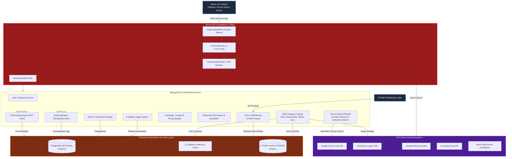

# SecondHand - Enterprise C2C Marketplace & AI Negotiation Platform

### Technology Stack

**Frontend & UI:** React 19, Vite 5.4, TailwindCSS 3
**Backend & Architecture:** Spring Boot 3.5.4, PostgreSQL 15, Redis 7 (Lua Scripting), Apache Kafka 3.7 (KRaft Event-Driven), Flyway, MapStruct
**Messaging & Events:** Apache Kafka (Transactional Outbox + Asynchronous Event-Driven Architecture)
**AI & External Services:** Google Gemini LLM API, Cloudinary, OAuth2 (Google/GitHub), JWT
**DevOps & Observability:** Docker (Compose with Postgres, Redis, Kafka), Prometheus, Grafana, Spring Boot Actuator, Swagger/OpenAPI

**SecondHand** is a production-grade, highly scalable, and secure C2C (Customer-to-Customer) marketplace platform. It combines enterprise-level Java backend engineering (Spring Boot 3.5) with an asynchronous **Event-Driven Kafka architecture**, **Redis Lua atomic stock reservation**, and a modern React 19 web application. 

The platform features an advanced **Escrow payment & E-Wallet** model, **Transactional Outbox + Kafka event distribution**, **real-time WebSocket STOMP messaging**, **AOP-driven audit logging**, **custom cookie-based OAuth2/JWT session rotation**, and **"Aura"**—a state-of-the-art semantic search and conversational AI assistant powered by Google Gemini.

## Agent Start (AI Coding Rules)

For AI agents (Antigravity, Cursor, etc.):
1. **MANDATORY**: Start by reading the [`GEMINI.md`](GEMINI.md) file in the root directory. It contains all project rules, context, and the central runbook.
2. Skill behaviors (Documentation Sync, Domain Editor, Repo Navigator, Token Saver) are explicitly defined under the `.agents/skills/` directory. Use them strictly when needed.
3. Read the relevant backend module `README.md` for domain-specific business rules.
4. Read only the source files involved in the change.

Rules of thumb:
- Keep the diff minimal.
- Prefer existing module patterns over new abstractions.
- Treat `auth`, `payment`, `escrow`, `order`, `cart`, and `listing` as high-risk domains.
- If behavior changes, update the matching README or artifact in the same turn.

---

## System Architecture


```mermaid
graph TD
    classDef client fill:#1E293B,stroke:#3B82F6,stroke-width:2px,color:#fff;
    classDef security fill:#991B1B,stroke:#EF4444,stroke-width:2px,color:#fff;
    classDef core fill:#0F766E,stroke:#0D9488,stroke-width:2px,color:#fff;
    classDef database fill:#7C2D12,stroke:#F97316,stroke-width:2px,color:#fff;
    classDef thirdparty fill:#4C1D95,stroke:#8B5CF6,stroke-width:2px,color:#fff;

    %% Clients
    ReactApp["React 19 Frontend<br>(Tailwind, Framer Motion, Query)"]:::client
    WebSocketClient["STOMP WebSocket Client"]:::client

    %% Security Gate
    subgraph SecurityGateway ["Secure API Gatekeeper & Filters"]
        RateLimit["RateLimitingFilter (Custom Tokens)"]
        CorsCsrf["CsrfCookieFilter & CorsConfig"]
        JwtFilter["AuthenticationFilter & JWT Rotation"]
        SecurityHeaders["SecurityHeadersFilter"]
    end
    class SecurityGateway security;

    %% Backend Controllers & Modules
    subgraph SpringBootBackend ["Spring Boot 3.5 Backend Services"]
        direction TB
        UserController["User & Address Service"]
        ListingController["Multi-Category Listings<br>(Cars, Real Estate, Books, etc.)"]
        ChatController["Chat & WebSocket STOMP Engine"]
        EscrowService["Escrow Transaction Engine"]
        EWalletService["E-Wallet Ledger System"]
        PricingEngine["Campaign, Coupon & Pricing Engine"]
        ShowcaseService["Showcase Slot Auction & Scheduler"]
        AuraAgent["Aura AI Gemini Engine<br>(Context Injection & Semantic Search)"]
        AuditAspect["AuditLogAspect (Declarative AOP)"]
        PriceHistory["PriceHistoryAspect (AOP Track)"]
    end
    class SpringBootBackend core;

    %% Databases & Cache
    subgraph DataStorage ["Enterprise Persistence & Cache Layers"]
        PostgresDB[("PostgreSQL DB (Flyway Schema)")]
        CaffeineCache["L1 Caffeine In-Memory Cache"]
        RedisDB[("L2 Redis Cache & Pub/Sub Brokers")]
    end
    class DataStorage database;

    %% External Services
    subgraph ThirdPartyIntegrations ["Third-Party Cloud Integrations"]
        GeminiAPI["Google Gemini LLM API"]
        CloudinaryAPI["Cloudinary Image CDN"]
        OAuthProviders["Google/GitHub OAuth2"]
        ExchangeAPI["Exchange Rate API"]
        MailServer["SMTP Mail Server (Templates)"]
    end
    class ThirdPartyIntegrations thirdparty;

    %% Connections
    ReactApp -->|REST API over SSL| RateLimit
    WebSocketClient -->|WS Protocol| ChatController
    
    RateLimit --> CorsCsrf
    CorsCsrf --> JwtFilter
    JwtFilter --> SecurityHeaders
    SecurityHeaders --> SpringBootBackend

    %% Services interactions
    ListingController -->|L1/L2 Caching| CaffeineCache
    ListingController -->|L1/L2 Caching| RedisDB
    EWalletService -->|Relational Database| PostgresDB
    EscrowService -->|Transactions| PostgresDB
    ChatController -->|Pub/Sub Event Broker| RedisDB
    AuraAgent -->|Semantic Prompt Context| GeminiAPI
    ListingController -->|Image Storage| CloudinaryAPI
    JwtFilter -->|Social Sign-In| OAuthProviders
    SpringBootBackend -->|Audit Logs| AuditAspect
    SpringBootBackend -->|Price Tracks| PriceHistory
    AuditAspect -->|Transactional Logs| PostgresDB
    PriceHistory -->|Price Analytics| PostgresDB
```

---

## Core Feature Highlights

### Symmetric Modular Design
The project stands out for its high-grade architectural symmetry. For every backend package (representing a domain model), there is a corresponding frontend workspace folder under `src/`. This enforces solid clean code separation and eases cross-stack features implementation.

### System Capabilities & Subsystems

| Subsystem | Backend Package (Java 17) | Frontend Directory (React 19) | Architectural & Technical Implementation Details | Key Business Rules & Solved Challenges |
| :--- | :--- | :--- | :--- | :--- |
| **Auth & Social Identity** | `com.serhat.secondhand.auth` | `src/auth` | Multi-provider OAuth2 (Google/GitHub) and local credentials auth integrated with custom Spring Security filters. Implements secure HTTP-only cookies, JWT access/refresh token rotation, and invalidation tracking on logout. | Secures session lifecycle against CSRF/XSS. Blocks hijacked sessions dynamically without database overhead on every request. |
| **System Security** | `com.serhat.secondhand.core.security` | N/A | Custom Token Bucket-based `RateLimitingFilter`, `CsrfCookieFilter`, and strict HTTP headers security. Fine-grained CORS configurations and JWT signature validation at filter level. | Prevents API abuse and DoS attacks. Handles rate resets gracefully returning 429 status codes with Retry-After metadata. |
| **Payment & Ledgers** | `com.serhat.secondhand.payment`, `ewallet` | `src/ewallet` | Double-entry transaction ledger with **Transactional Outbox Pattern** (`payment_outbox_events`). Payments are persisted atomically in PostgreSQL and published asynchronously via Kafka (`payment.completed.v1`). | Eliminates Dual-Write risks and guarantees At-Least-Once event delivery. Sub-150ms HTTP response times for checkout. |
| **Escrow & Safe Trade** | `com.serhat.secondhand.escrow` | `src/ewallet` | Holds buyer's funds securely in virtual escrow holding accounts. Delivery confirmations trigger an outbox event (`escrow_outbox_events`) to asynchronously credit the seller's wallet via Kafka (`escrow.released.v1`). | Builds consumer trust. Seller payments are guaranteed and released asynchronously with zero data loss risk upon delivery confirmation. |
| **Order Lifecycle** | `com.serhat.secondhand.order`, `checkout` | `src/order` | Finite State Machine managing order stages (`CONFIRMED`, `PROCESSING`, `SHIPPED`, `DELIVERED`, `COMPLETED`). Uses `OrderItemCompensationPlanner` for partial refunds and cancellations. | Prevents state inconsistency. Transactional Outbox coordinates cross-domain side effects (inventory, email, escrow). |
| **Cart & Stock Control** | `com.serhat.secondhand.cart`, `inventory` | `src/cart` | **Redis Lua Atomic Stock Reservation** (`reserve_stock_with_ttl.lua`). 15-minute TTL locks stock in RAM without DB row locks. Post-payment stock deductions execute via Kafka `InventoryKafkaConsumer`. | Zero DB deadlocks, eliminates race conditions and over-selling on flash sales, auto-reclaims abandoned carts instantly. |
| **Aura AI Engine** | `com.serhat.secondhand.ai` | `src/ai` | Gemini-powered semantic orchestrator (`AuraListingSearchOrchestrator`) that plans database queries based on free-form human text. Injectable workspace context adapters. | Translates fuzzy queries (e.g. "sporty red diesel car under 800k") into strict database parameters. Provides dynamic price suggestions to listings. |
| **Real-Time Chat** | `com.serhat.secondhand.chat` | `src/chat`, `src/inbox` | WebSocket engine based on STOMP messaging protocol. Leverages Spring's channel interceptors to validate JWT tokens on connection shake hands. | Low-latency private rooms between buyers and sellers. Keeps track of instant online indicators and unread message tallies. |
| **Offers & Bids** | `com.serhat.secondhand.offer` | `src/offer` | Advanced negotiation system with 24-hour **Redis Reservation Locks** (`offer:reservation:{listingId}`) upon seller acceptance. | Locks discounted price and stock exclusively for the winning buyer, preventing other buyers from sniping accepted offers. |
| **Campaign & Coupons** | `com.serhat.secondhand.campaign`, `coupon` | `src/campaign`, `coupon` | Marketing framework protected by **Atomic Redis Lua Limiters** (`apply_coupon_with_limit.lua`) for global and per-user redemption limits. | Prevents over-usage and database bottlenecks during concurrent flash-sale coupon redemptions. |
| **Showcase Slots** | `com.serhat.secondhand.showcase` | `src/showcase` | Paid showcase visibility with **Redis TTL Caching** (`showcase:active:{listingId}`). Automatically expires matching the showcase duration. | Monetizes user listings and delivers sub-millisecond showcase validation without polling database overhead. |
| **Forums & Reviews** | `com.serhat.secondhand.forum`, `review` | `src/forum`, `reviews` | Structured QA threads, community comment boards, and double-blind user rating mechanisms. | Creates a community marketplace. Prevents fake reviews by validating that reviewers have a completed purchase history with the seller. |

---

## Aura - The Gemini AI Core Engine

At the heart of **SecondHand** lies **Aura**, an advanced AI platform agent powered by **Google Gemini** API. Aura is not just a chatbot; it is a context-aware transactional agent deeply integrated into the platform's workspace.

```
       ┌──────────────────────────────┐
       │   React Conversational UI    │
       └──────────────┬───────────────┘
                      │ User query / context
                      ▼
 ┌──────────────────────────────────────────┐
 │    AuraListingSearchOrchestrator         │ ◄─── Rate Limiter
 └────────────────────┬─────────────────────┘
                      │ 
       ┌──────────────┴──────────────┐
       ▼                             ▼
┌──────────────┐             ┌──────────────┐
│ Search Plan  │             │   Context    │
│  Generator   │             │  Adapters    │
└──────┬───────┘             └──────┬───────┘
       │                            │ Inject data:
       │ Semantic queries           ├─► Active Listings context
       ▼                            ├─► Cart & Checkout info
┌──────────────┐             ├─► Order history
│ PostgreSQL / │             └─► Active notifications
│  Redis Cache │                     │
└──────┬───────┘                     │ Final rich instructions
       │                             ▼
       │                     ┌──────────────┐
       └────────────────────►│ Gemini Client│
                             └──────┬───────┘
                                    │ Response
                                    ▼
                      ┌───────────────────────────┐
                      │   Smart UI & Component    │
                      │ Render (Accept offer, etc)│
                      └───────────────────────────┘
```

### Key AI Features:
*   **Semantic Listing Search Orchestrator (`AuraListingSearchOrchestrator`)**: Translates messy user speech (e.g. *"I need a red sporty car that runs on diesel under 800k TL"*) into strict SQL database queries, complete with search plans and multi-tier fallbacks.
*   **Context Adapter Engine**: Dynamically injects context into Gemini prompt boundaries based on the user's workspace (e.g. active listing, cart reservation, checkout status, or recent notification logs).
*   **Dynamic Price Advisor**: Evaluates pricing history and trends for categories to advise sellers on whether their pricing is competitive, low, or high.
*   **Automated Listing Generator**: Takes rough details from sellers and generates beautiful, optimized description copy including details, hashtags, and category recommendations.
*   **Interactive Negotiator**: Powers virtual bargaining. Buyers can chat with Aura to analyze their offer's likelihood of acceptance.

---

## High-Performance Checkout, Escrow & Event-Driven Engine

A primary pillar of the SecondHand marketplace is trust, high-throughput checkout, and zero data loss. The platform integrates a modern event-driven stack:

### 1. In-Memory Atomic Stock Reservation (Redis Lua)
To prevent race conditions on low-stock items and eliminate database row locking:
*   **Sub-Millisecond Lua Execution**: Checking stock and acquiring reservation is executed atomically in Redis (`reserve_stock_with_ttl.lua`).
*   **Automatic 15-Minute TTL Reclaim**: If a user abandons checkout, the TTL expires and the reservation key vanishes automatically without batch schedulers or DB write locks.
*   **Manual Cancellation**: When a user removes an item or cancels checkout, `cancel_user_reservation.lua` frees the stock instantly.

### 2. Transactional Outbox Pattern (Dual-Write Prevention)
*   **PostgreSQL ACID Guarantee**: Payments and Escrow releases write to their primary tables (`payments`, `escrows`) and their respective outbox tables (`payment_outbox_events`, `escrow_outbox_events`) in the same database transaction.
*   **At-Least-Once Delivery**: Background workers (`PaymentOutboxWorker`, `EscrowOutboxWorker`) poll pending outbox records and dispatch them to Apache Kafka topics (`payment.completed.v1`, `escrow.released.v1`).

### 3. Asynchronous Kafka Consumers
*   **Inventory Deductions**: `InventoryKafkaConsumer` receives `PaymentCompletedKafkaEvent` with exact item quantities and updates the physical inventory record in PostgreSQL.
*   **Escrow Release & Wallet Credit**: `EscrowKafkaConsumer` receives `EscrowReleasedKafkaEvent` and asynchronously deposits funds into the seller's e-wallet (`creditWalletQuietly`).

### 4. Flash-Sale Coupon Limiter & Offer Reservation
*   **Atomic Coupon Limiter**: `apply_coupon_with_limit.lua` ensures strict global and per-user limits under high concurrency without database lock contention.
*   **24-Hour Offer Locks**: `OfferRedisReservationService` establishes dedicated locks (`offer:reservation:{listingId}`) when a seller accepts an offer, protecting the buyer's exclusive right to buy at the agreed price.

---

## Deep-Dive into Backend Architectural Patterns

### 1. Advanced Rate Limiting Filter (`RateLimitingFilter`)
Rather than relying on basic API gates, SecondHand secures its application layer using a highly configurable Token Bucket rate limiter built on core Spring configurations.
*   **Route-Specific Limits**: Auth, AI Agent, Payment, and General endpoints possess individual limit scopes (defined in `.env`).
*   **Client Identification**: Identifies consumers using unified JWT signatures or IP-fallback mechanisms.
*   **Graceful Handling**: Returns specialized standard error codes (`429 Too Many Requests`) with clear time-to-reset metadata.

### 2. Declarative AOP-Driven Auditing (`AuditAspect`)
Uses Spring Aspect-Oriented Programming (AOP) to implement system auditing across multiple service layers.
*   Annotating a method automatically records the executor, raw inputs, operation results, and time metrics to the `audit_logs` database table.
*   Zero performance footprint using async logging executors.

### 3. Price Tracking Aspect (`PriceHistoryAspect`)
A specialized aspect that listens to listing updates. If the price of an item shifts, the system automatically records a snapshot in the price database table.
*   Powers visual charts on the frontend, allowing buyers to see pricing fluctuations over time.
*   Protects data integrity by catching only successful database commits.

### 4. Two-Tier Cache Architecture (`Caffeine` + `Redis`)
To minimize database query costs, the platform utilizes a robust two-tier caching mechanism:
*   **L1 (In-Memory)**: Caffeine cache for immediate local storage (enums, configurations, listing categories) with low latency.
*   **L2 (Distributed)**: Redis cluster caches listing searches, homepage contents, and session tokens. Includes dynamic cache invalidation on listing updates.

---

## Installation & Setup Guide

### Prerequisites
Make sure you have the following installed on your system:
*   **Java 17 SE Development Kit (JDK)**
*   **Node.js (v18+)** & **npm**
*   **Docker Desktop** (for PostgreSQL, Redis, Prometheus, Grafana)

---

### Step 1: Fire up Database & Infrastructure Services
The project includes a ready-to-go `docker-compose.yml` defining development databases, Redis, and monitoring setups.

Run the following command in the root folder:
```bash
docker-compose up -d
```
This boots:
*   **PostgreSQL 15** on port `5433` (avoiding local `5432` conflicts).
*   **Redis 7** on port `6379`.
*   **Prometheus** on port `9090` (Scraping Spring boot actuator metrics).
*   **Grafana** on port `3000` (Pre-provisioned with metrics dashboards).

---

### Step 2: Configure & Start the Backend

1.  Copy the environment template in the root directory:
    ```bash
    cp .env.template .env
    ```
2.  Fill in your API keys in the newly created `.env` file (e.g. JWT secret key, Cloudinary keys, and your **Google Gemini API Key**):
    ```env
    JWT_SECRET_KEY=your_very_secret_key_here_min_32_chars
    GEMINI_API_KEY=AIzaSy...your_gemini_api_key...
    CLOUDINARY_CLOUD_NAME=your_cloud_name
    CLOUDINARY_API_KEY=your_api_key
    CLOUDINARY_API_SECRET=your_api_secret
    ```
    *(Note: If you have Postgres and Redis running from Docker, the default database and cache settings in the template are ready to go)*

3.  Build and package the Spring Boot backend using the Maven wrapper:
    ```bash
    ./mvnw clean package -DskipTests
    ```
4.  Run the application:
    ```bash
    ./mvnw spring-boot:run
    ```
    *The server will boot on **http://localhost:8080** and Flyway will automatically execute database migrations.*
    *You can access the interactive **Swagger/OpenAPI UI** at [http://localhost:8080/swagger-ui/index.html](http://localhost:8080/swagger-ui/index.html).*

---

### Step 3: Configure & Start the Frontend

1.  Navigate to the frontend folder:
    ```bash
    cd secondhand-frontend
    ```
2.  Install the project dependencies:
    ```bash
    npm install
    ```
3.  Configure local environment variables. Create a `.env.local` or edit the existing `.env` file:
    ```env
    VITE_API_BASE_URL=http://localhost:8080/api/v1
    VITE_WS_BASE_URL=ws://localhost:8080/ws
    ```
4.  Boot up the Vite React server:
    ```bash
    npm run dev
    ```
    *The application will launch on **http://localhost:5173**.*

---

## Security Best Practices Implemented

*   **Secure HttpOnly Session Cookies**: JWT access and refresh tokens are stored in secure, HttpOnly, SameSite cookies to protect the system against XSS (Cross-Site Scripting) and CSRF (Cross-Site Request Forgery) attacks.
*   **OAuth2 Client Security**: Handles Google authentication server-side, verifying identity tokens securely and preventing token manipulation.
*   **CSRF Prevention**: Active `CsrfCookieFilter` requires matching double-submit cookie tokens for all modifying requests (POST, PUT, DELETE).
*   **Secure STOMP Websocket**: Employs specific interceptors that parse JWT auth records during connection initialization, guarding chat rooms from unauthenticated socket listeners.

---

## Observability & Metrics

With Spring Actuator and Micrometer integration, developers can monitor the health, JVM stats, CPU usage, and custom business metrics (e.g. active listings, successful payments).

*   **Prometheus Target**: Scraping HTTP endpoint `http://localhost:8080/actuator/prometheus`.
*   **Grafana Dashboard**: Open [http://localhost:3000](http://localhost:3000) (Default user/pass: `admin`/`admin`) to view preloaded dashboards illustrating real-time HTTP request delays, system CPU spikes, and memory heap profiles.

---


> [!TIP]
> **Flyway Migrations:**
> All schema edits are strictly tracked via SQL migrations in [src/main/resources/db/migration](file:///Users/serhat/IdeaProjects/secondHand/src/main/resources/db/migration). Never modify existing migration files; always append a new `V[X]__some_description.sql` file if you change the database schema.
