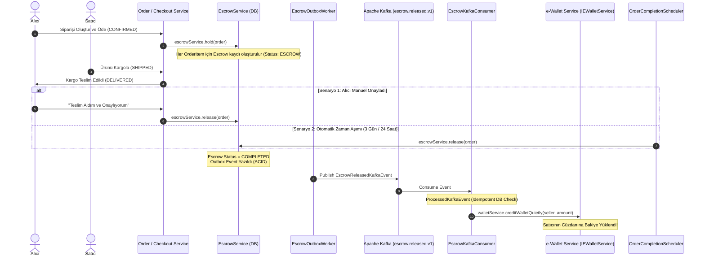

# Escrow (Güvenli Havuz) Yaşam Döngüsü ve Durum Makinesi Rehberi

Bu doküman, **secondHand** platformunun finansal güvenliğini ve güvenli ticaret altyapısını oluşturan **Escrow (Emanet / Güvenli Havuz) Durum Makinesi**, **Asenkron Cüzdan Aktarımı (Kafka & Outbox)**, **İptal/İade Telafi Mekanizmaları** ve **Zaman Aşımı Otomasyonunu** uçtan uca açıklamaktadır.

---

## 1. Problem Tanımı ve Escrow Çözümü

C2C (Tüketiciden Tüketiciye) ikinci el e-ticarette iki taraf da risk altındadır:
* **Alıcı Riski:** "Parayı ödersem satıcı ürünü göndermezse veya bozuk/farklı ürün gönderirse ne olacak?"
* **Satıcı Riski:** "Ürünü kargolarsam alıcı parayı ödemezse veya sahte bildirim yaparsa ne olacak?"

### secondHand Escrow Modeli:
1. Alıcı ödemeyi yaptığında para doğrudan satıcının hesabına aktarılmaz; sistemin güvenli emanet havuzunda (`ESCROW` statüsünde) bloke edilir.
2. Satıcı ürünü kargolar veya güvenli buluşma ile teslim eder.
3. Alıcı ürünü teslim alıp inceledikten sonra onay verir (veya yasal onay süresi dolunca sistem otomatik onaylar).
4. Havuzdaki para satıcının **e-Cüzdanına (`eWallet`)** aktarılır.

---

## 2. Uçtan Uca Escrow Durum Makinesi ve Sıralama Diyagramı



---

## 3. Escrow Durumları (State Machine)

| Durum (`PaymentStatus`) | Açıklama | Paranın Konumu | Sonraki Olası Durumlar |
| :--- | :--- | :--- | :--- |
| **`ESCROW`** | Sipariş ödendi; para güvenli emanet havuzunda kilitli tutuluyor. | Sistem Havuzu | `COMPLETED`, `CANCELLED`, `REFUNDED` |
| **`COMPLETED`** | Alıcı onayladı veya teslimat süresi doldu. Para satıcıya aktarıldı. | Satıcı Cüzdanı (`eWallet`) | *Terminal Durum (Son Durum)* |
| **`CANCELLED`** | Kargolanmadan önce sipariş iptal edildi. Para alıcıya iade edildi. | Alıcı Cüzdanı / Kart | *Terminal Durum* |
| **`REFUNDED`** | Ürün iade edildi / uyuşmazlık alıcı lehine sonuçlandı. | Alıcı Cüzdanı | *Terminal Durum* |

---

## 4. Kritik İş Mantığı ve Teknik Mekanizmalar

### A. Çoklu Sepetlerde Oransal Tutar Bölüştürme (`calculateEscrowAmounts`)
Kullanıcı sepetinde birden fazla farklı satıcıya ait ürün olduğunda ve genel bir sepet kuponu veya indirim uygulandığında, her ürün kaleminin (`OrderItem`) emanet tutarı kuruş hassasiyetinde (`RoundingMode.HALF_UP`) oransal olarak hesaplanır ([`EscrowService.java`](file:///Users/serhat/IdeaProjects/secondHand/src/main/java/com/serhat/secondhand/escrow/application/EscrowService.java)):

$$\text{Escrow Tutarı} = \text{Toplam Ödenen Tutar} \times \frac{\text{Ürün Fiyatı}}{\text{Sepet Ürün Toplamı}}$$

* Kuruş yuvarlama farklarının havuzda açık yaratmaması için son ürün kalemi `remaining` bakiye üzerinden dengelenir.

---

### B. Otomatik Serbest Bırakma Mekanizması ([`OrderCompletionScheduler.java`](file:///Users/serhat/IdeaProjects/secondHand/src/main/java/com/serhat/secondhand/order/application/OrderCompletionScheduler.java))

Alıcı ürünü teslim almasına rağmen panelden onay vermeyi unutursa satıcının mağdur olmaması için **Otomatik Mutabakat Scheduler'ı** devrededir:
1. **Kargolu Gönderimler:** Ürün `DELIVERED` durumuna geçtikten sonra belirlenen yasal inceleme süresi (örneğin 3 gün) boyunca alıcı uyuşmazlık bildirmezse scheduler `escrowService.release(order)` çağrısını yapar.
2. **Güvenli Buluşma (`SAFE_MEETUP`):** Buluşma kodu doğrulandıktan (`HANDOVER_CONFIRMED`) 24 saat sonra emanet para otomatik olarak satıcıya serbest bırakılır.

---

### C. Finansal Dayanıklılık: Transactional Outbox & Kafka Pipeline

Doğrudan `escrowService.release()` içinde üçüncü parti cüzdan/banka servisine senkron HTTP veya doğrudan Kafka çağrısı yapmak **Dual-Write** riski taşır (DB commit olup Kafka çökerse para buharlaşır; tersi durumda satıcıya çifte para gider).

Bu nedenle **Transactional Outbox** mimarisi uygulanmıştır:
1. `escrowService.release(order)` çalıştığında Escrow tablosu `COMPLETED` yapılır ve aynı ACID transaction içinde `escrow_outbox_events` tablosuna `EscrowReleased` event'i yazılır.
2. [`EscrowOutboxWorker.java`](file:///Users/serhat/IdeaProjects/secondHand/src/main/java/com/serhat/secondhand/escrow/outbox/EscrowOutboxWorker.java) bekleyen eventleri okuyup `escrow.released.v1` Kafka topic'ine gönderir.
3. [`EscrowKafkaConsumer.java`](file:///Users/serhat/IdeaProjects/secondHand/src/main/java/com/serhat/secondhand/escrow/application/EscrowKafkaConsumer.java) mesajı tüketir.
4. **Idempotency Kilidi:** `ProcessedKafkaEventRepository` üzerinden `escrow:release:{escrowId}` deduplication kontrolü yapılır (`INSERT ON CONFLICT DO NOTHING`).
5. Satıcının cüzdanına (`IEWalletService.creditWalletQuietly`) güvenle aktarılır.

---

### D. İptal ve İade Telafisi (Cancellation & Refund Compensation)

* Sipariş henüz kargolanmadan iptal edilirse (`cancel`) veya iade onaylanırsa (`refund`), para satıcıdan **çekilmez** (çünkü satıcıya henüz para geçmemiştir).
* Sistem emanet havuzundaki bloke bakiyeyi doğrudan alıcının e-cüzdanına `REFUND` işlem türüyle transfer eder:
  ```java
  walletService.creditToUser(order.getUser(), escrow.getAmount(), escrow.getListingId(), ... PaymentTransactionKind.REFUND, null);
  ```

---

## 5. Escrow Denetim ve Güvenlik Snapshot'ı (Audit Snapshot)

Olası yasal uyuşmazlıklar ve denetimler için `Escrow` entity'si ilişkisel foreign key'lerin yanı sıra işlemin yapıldığı andaki ilan başlığını, ilan numarasını ve tarih loglarını snapshot olarak saklar:
* `listingTitle`, `listingNo`, `listingId`
* `blockedAt` (Bloke Tarihi)
* `releasedAt` (Satıcıya Aktarım Tarihi)
* `refundedAt` (Alıcıya İade Tarihi)
* Veritabanı composite indeksleri: `(order_id)`, `(seller_id)`, `(status)`.

---

## 6. Hata ve Uç Durumlar (Edge Cases) Matrisi

| Senaryo | Risk | Sistem Nasıl Önler? |
| :--- | :--- | :--- |
| **Mükerrer Teslimat Onayı** | Alıcı butona arka arkaya 5 kez basarsa çift para aktarımı. | `EscrowRepository.findByOrderIdAndStatusForUpdate` ile satır kilitlenir; ilk işlemden sonra status `COMPLETED` olduğu için diğer istekler no-op döner. |
| **Kafka Rebalancing / Retry** | Kafka aynı mesajı tüketiciye 2 kez iletirse mükerrer cüzdan bakiyesi. | Consumer seviyesinde `processed_kafka_events` tablosunda `escrow:release:{escrowId}` deduplication key ile exactly-once garanti edilir. |
| **Outbox Gönderim Hatası** | Kafka broker geçici olarak kapalıysa. | `EscrowOutboxWorker` exponential backoff ile `next_attempt_at` günceller ve broker açılana kadar güvenle dener. |
