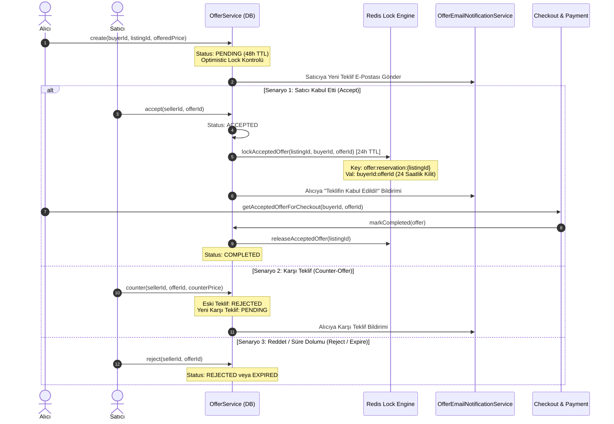

# Teklif (Offer/Pazarlık) Sistemi ve 24 Saatlik Alıcı Kilidi (Concurrency Lock) Rehberi

Bu doküman, **secondHand** platformunun pazarlık/teklif altyapısını oluşturan **Teklif Yaşam Döngüsü (State Machine)**, **Redis Tabanlı 24 Saatlik Alıcı Kilidi (`offer:reservation:{listingId}`)**, **Karşı Teklif (Counter-Offer) Ağacı** ve **Eşzamanlılık (Optimistic Locking & Concurrency Control)** kurallarını detaylandırmaktadır.

---

## 1. Problem Tanımı ve Neden Özel Bir Kilit Gerekir?

İkinci el e-ticarette pazarlık yapıldığında şu kritik yarış durumları (Race Conditions) ortaya çıkar:
1. **Çifte Kabul (Double Acceptance):** Satıcı aynı anda 2 farklı kullanıcının teklifini kabul ederse tek adet olan ürün kime satılacak?
2. **Kabul Edilen Teklifin Çalınması (Price Sniping):** Satıcı bir alıcıyla pazarlıkta anlaşıp teklifi kabul ettiğinde, başka bir alıcı araya girip ürünü normal fiyattan satın alırsa pazarlık yapan alıcının hakkı gasp edilir.
3. **Bekleyen Tekliflerin Askıda Kalması:** Bir teklif kabul edildiğinde veya karşı teklif verildiğinde eski tekliflerin durumu ne olacak?

### secondHand Çözümü:
* Satıcı bir teklifi kabul ettiği anda **Redis üzerinde 24 saatlik özel alıcı kilidi (`offer:reservation:{listingId}`)** oluşturulur.
* Bu süre boyunca ürün yalnızca teklifi kabul edilen alıcıya indirimli fiyattan rezerve edilir; başka hiçbir alıcı ürünü satın alamaz veya yeni teklif veremez.

---

## 2. Teklif Yaşam Döngüsü ve Sıralama Diyagramı



---

## 3. Teklif Durum Makinesi (`OfferStatus`)

| Durum | Anlamı / Paranın ve Kilidin Durumu | Sonraki Olası Durumlar |
| :--- | :--- | :--- |
| **`PENDING`** | Teklif verildi, karşı tarafın yanıtı bekleniyor (varsayılan 48 saat geçerli). | `ACCEPTED`, `REJECTED`, `EXPIRED` |
| **`ACCEPTED`** | Satıcı kabul etti. **Redis üzerinde 24 saatlik alıcı kilidi aktif.** | `COMPLETED`, `EXPIRED`, `REJECTED` |
| **`REJECTED`** | Teklif reddedildi veya üzerine karşı teklif verildi. | *Terminal Durum* |
| **`EXPIRED`** | Süre doldu (yanıtsız 48 saat veya kabul sonrası 24 saat ödeme süresi dolumu). | *Terminal Durum* |
| **`COMPLETED`** | Alıcı teklifli fiyattan checkout/ödemeyi başarıyla tamamladı. | *Terminal Durum* |

---

## 4. Kritik Eşzamanlılık ve Güvenlik Mekanizmaları

### A. Redis Tabanlı 24 Saatlik Alıcı Kilidi ([`OfferRedisReservationService.java`](file:///Users/serhat/IdeaProjects/secondHand/src/main/java/com/serhat/secondhand/offer/application/OfferRedisReservationService.java))
```java
public boolean lockAcceptedOffer(UUID listingId, Long buyerId, UUID offerId) {
    String key = "offer:reservation:" + listingId;
    String value = buyerId + ":" + offerId;
    Boolean acquired = redisTemplate.opsForValue().setIfAbsent(key, value, Duration.ofHours(24));
    return Boolean.TRUE.equals(acquired);
}
```
* `setIfAbsent` (`SETNX`) ile ilan üzerinde aynı anda sadece **tek bir aktif kabul** bulunabilir.
* 24 saat içinde ödeme yapılmazsa anahtar Redis'ten otomatik düşer ve ilan serbest kalır.

---

### B. Karşı Teklif (Counter-Offer) Ağaç Mimarisi
* Bir teklife karşı teklif verildiğinde (`counter`), önceki teklif kaydı `REJECTED` durumuna çekilir.
* Yeni teklif `parentOfferId` referansı ile oluşturulur; böylece taraflar arasındaki tüm pazarlık geçmişi şeffaf bir zincir olarak denetlenebilir.

---

### C. Veritabanı Düzeyinde İkili Kilit (Pessimistic & Optimistic Lock)
* `accept()` anında hem `@Version` optimistik kilidi hem de `listingService.findByIdWithLock(listingId)` ile veritabanı satır kilidi (`Pessimistic Lock`) alınır.
* Bu sayede yarış durumunda iki istek aynı milisaniyede gelse dahi yalnızca biri kabul edilir, diğeri `OFFER_CONCURRENT_MODIFICATION` veya `OFFER_ALREADY_ACCEPTED_FOR_LISTING` hatası alır.

---

## 5. Hata ve Uç Senaryolar (Edge Cases)

| Senaryo | Oluşan Durum | Sistemin Koruma Yöntemi |
| :--- | :--- | :--- |
| **1. Alıcı 24 Saat İçinde Satın Almadı** | Kilit askıda kalır mı? | Redis TTL (24h) dolunca kilit kendiliğinden silinir; `getAcceptedOfferForCheckout` çağrısında süre kontrolü yapılarak işlem reddedilir. |
| **2. Ürünün Stoğu Başkası Tarafından Tükendi** | Teklif kabul edilebilir mi? | `validateListingStockForOffer` ile fiziksel stok kontrol edilir; stok 0 ise teklif kabul edilemez. |
| **3. Redis Kesintisi / Çökmesi** | Kilit alınamazsa sistem durur mu? | `OfferRedisReservationService` hata anında DB satır kilidine (fallback) güvenli düşüş yapar; kullanıcı akışı kesilmez. |
