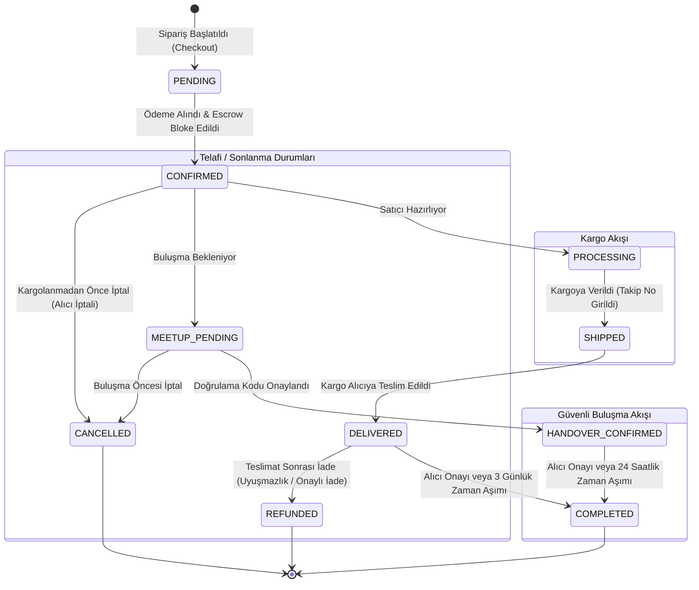

# Sipariş (Order) Yaşam Döngüsü, İptal/İade Telafi ve Teslimat Mimarisi Rehberi

Bu doküman, **secondHand** platformundaki **Sipariş Durum Makinesi (Order State Machine)**, **Kargo & Güvenli Buluşma (Safe Meetup) Akışları**, **Kalem Bazlı İptal & İade Telafi Yönetimi (Compensation Planner)** ve **Transactional Outbox Olay Boru Hattını** detaylandırmaktadır.

---

## 1. Genel Sipariş Mimarisi ve Çift Teslimat Yolu

Siparişler, ikinci el platformunun doğası gereği iki farklı teslimat yöntemiyle işlenir:
1. **Kargo ile Teslimat (`CARGO`):** Standart kargo takibi ve teslimat onay süreci.
2. **Güvenli Buluşma (`SAFE_MEETUP`):** Alıcı ve satıcının yüz yüze buluşup OTP / doğrulama kodu ile teslimatı gerçekleştirdiği yerel akış.

---

## 2. Uçtan Uca Sipariş Durum Makinesi (Order State Machine)

---

## 3. Sipariş Durumları ve İşlem Yetki Matrisi ([`OrderStatus.java`](file:///Users/serhat/IdeaProjects/secondHand/src/main/java/com/serhat/secondhand/order/entity/enums/OrderStatus.java))

| Durum | Açıklama | İptal Edilebilir (`isCancellable`) | İade Edilebilir (`isRefundable`) | Adres/Not Değişebilir (`isModifiable`) | Tamamlanabilir (`isCompletable`) |
| :--- | :--- | :---: | :---: | :---: | :---: |
| **`PENDING`** | Ödeme bekleniyor | ✅ | ❌ | ✅ | ❌ |
| **`CONFIRMED`** | Ödeme alındı, Escrow'da bloke | ✅ | ❌ | ✅ | ❌ |
| **`PROCESSING`** | Satıcı siparişi paketliyor | ❌ | ❌ | ❌ | ❌ |
| **`SHIPPED`** | Kargoya verildi, yolda | ❌ | ❌ | ❌ | ❌ |
| **`DELIVERED`** | Alıcıya teslim edildi (İnceleme süresi) | ❌ | ✅ | ❌ | ✅ |
| **`MEETUP_PENDING`** | Güvenli buluşma bekleniyor | ✅ | ❌ | ❌ | ❌ |
| **`HANDOVER_CONFIRMED`** | Buluşmada ürün elden teslim edildi | ❌ | ❌ | ❌ | ✅ |
| **`COMPLETED`** | Onaylandı; para satıcıya aktarıldı | ❌ | ❌ | ❌ | ❌ |
| **`CANCELLED`** | Kargolanmadan iptal edildi; para alıcıda | ❌ | ❌ | ❌ | ❌ |
| **`REFUNDED`** | İade onaylandı; para alıcıya döndü | ❌ | ❌ | ❌ | ❌ |

---

## 4. Kalem Bazlı İptal ve İade Telafi Yönetimi (Item-Level Compensation)

Bir siparişte farklı satıcılara ait birden fazla ürün bulunabilir. Bu nedenle iptal ve iade işlemleri hem **tüm sipariş** hem de **tek bir ürün kalemi (`OrderItem`)** bazında bağımsız işletilebilir.

### A. İptal Akışı ([`OrderCancellationService.java`](file:///Users/serhat/IdeaProjects/secondHand/src/main/java/com/serhat/secondhand/order/application/OrderCancellationService.java))
* **Koşul:** Sipariş `CONFIRMED` veya `MEETUP_PENDING` aşamasında olmalıdır (kargolanmış ürün iptal edilemez).
* **Adımlar:**
  1. [`OrderItemCompensationPlanner`](file:///Users/serhat/IdeaProjects/secondHand/src/main/java/com/serhat/secondhand/order/application/OrderItemCompensationPlanner.java) iptal edilecek kalemleri planlar.
  2. Her iptal edilen kalem için `OrderItemCancel` audit kaydı oluşturulur.
  3. [`EscrowService.cancel`](file:///Users/serhat/IdeaProjects/secondHand/src/main/java/com/serhat/secondhand/escrow/application/EscrowService.java) emanet havuzundaki parayı satıcıya gitmeden doğrudan alıcının e-cüzdanına iade eder.
  4. [`OrderOutboxService`](file:///Users/serhat/IdeaProjects/secondHand/src/main/java/com/serhat/secondhand/order/outbox/OrderOutboxService.java) üzerinden `ORDER_CANCELLED` eventi Outbox tablosuna yazılır.
  5. Kafka `order.cancelled.v1` topic'i üzerinden stoğun Redis ve PostgreSQL'e geri kazandırılması tetiklenir.

---

### B. İade Akışı ([`OrderRefundService.java`](file:///Users/serhat/IdeaProjects/secondHand/src/main/java/com/serhat/secondhand/order/application/OrderRefundService.java))
* **Koşul:** Sipariş `DELIVERED` durumunda olmalıdır (henüz `COMPLETED` olmamış, havuzdaki para satıcıya serbest bırakılmamış olmalıdır).
* **Adımlar:**
  1. İade nedeni (`CancelRefundReason`) ile birlikte `OrderItemRefund` kaydı açılır.
  2. [`EscrowService.refund`](file:///Users/serhat/IdeaProjects/secondHand/src/main/java/com/serhat/secondhand/escrow/application/EscrowService.java) havuzdaki parayı alıcıya iade eder.
  3. `OrderOutboxService` aracılığıyla `order.refunded.v1` Kafka eventi oluşturulur.

---

## 5. Otomasyon & Tamamlama Scheduler'ı ([`OrderCompletionScheduler.java`](file:///Users/serhat/IdeaProjects/secondHand/src/main/java/com/serhat/secondhand/order/application/OrderCompletionScheduler.java))

Sipariş durum geçişleri ve zaman aşımı mutabakatları arka planda periyodik olarak işletilir:
* **Kargo Simülasyonu & Durum İlerletme:** Test ortamında `CONFIRMED` $\rightarrow$ `PROCESSING` $\rightarrow$ `SHIPPED` $\rightarrow$ `DELIVERED` geçişleri zaman damgalarına göre otomatik ilerletilir.
* **3 Günlük Kargo Otomatik Tamamlama:** `DELIVERED` statüsündeki siparişler 3 gün boyunca alıcı tarafından uyuşmazlık bildirilmezse `escrowService.release(order)` tetiklenerek otomatik `COMPLETED` yapılır.
* **24 Saatlik Güvenli Buluşma Tamamlama:** `HANDOVER_CONFIRMED` statüsündeki siparişler 24 saat sonra otomatik tamamlanır.

---

## 6. Hata ve Eşzamanlılık Güvenceleri

| Risk / Senaryo | Mimari Koruma |
| :--- | :--- |
| **Kargoya Verilmiş Ürünü İptal Etmeye Çalışma** | `OrderStatus.isCancellable()` kontrolü ile `ORDER_NOT_CANCELLABLE` hatası fırlatılır. |
| **Tamamlanmış (COMPLETED) Siparişi İade Etme** | Para satıcıya aktarıldığı için `DELIVERED` dışındaki durumlarda iade reddedilir (`ESCROW_STATUS_INVALID`). |
| **Dual-Write Olay Kaybı** | Sipariş iptal/iade edildiğinde Kafka çağrısı doğrudan değil `order_outbox_events` ACID transaction'ı ile yapılır. |
| **Aynı Anda İptal ve Onay Basılması** | `EscrowRepository.findByOrderItemIdInForUpdate` ile satır düzeyinde Pessimistic Lock alınarak yarış durumu engellenir. |
