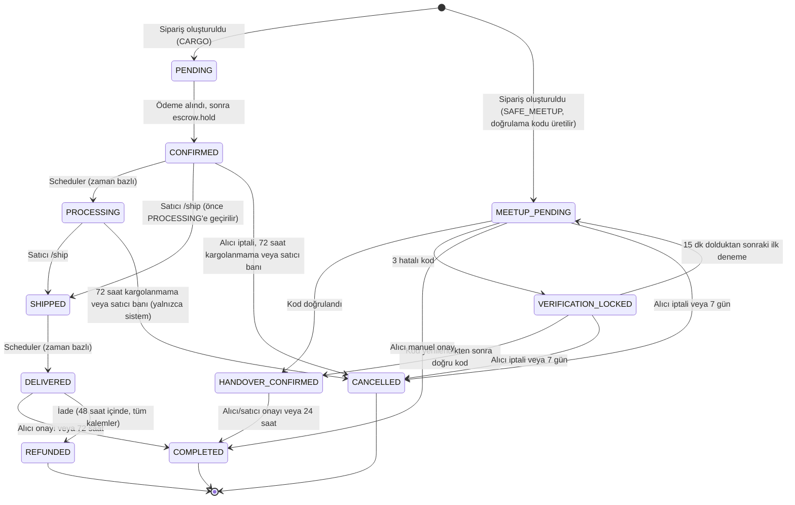

# Sipariş (Order) Yaşam Döngüsü, İptal/İade Compensation ve Teslimat Mimarisi Rehberi

Bu doküman, **secondHand** platformundaki **Sipariş Durum Makinesi (Order State Machine)**, **Kargo & Güvenli Buluşma (Safe Meetup) Akışları**, **Kalem Bazlı İptal & İade Compensation Yönetimi (Compensation Planner)** ve **Transactional Outbox Event Pipeline'ını** detaylandırmaktadır.

---

## 1. Genel Sipariş Mimarisi ve Çift Teslimat Yolu

Siparişler, ikinci el platformunun doğası gereği iki farklı teslimat yöntemiyle işlenir:
1. **Kargo ile Teslimat (`CARGO`):** Standart kargo takibi ve teslimat onay süreci.
2. **Güvenli Buluşma (`SAFE_MEETUP`):** Alıcı ve satıcının yüz yüze buluşup OTP / doğrulama kodu ile teslimatı gerçekleştirdiği yerel akış.

---

## 2. Uçtan Uca Sipariş Durum Makinesi (Order State Machine)

```mermaid
stateDiagram-v2
    [*] --> PENDING: Sipariş oluşturuldu (CARGO)
    [*] --> MEETUP_PENDING: Sipariş oluşturuldu (SAFE_MEETUP, doğrulama kodu üretilir)
    PENDING --> CONFIRMED: Ödeme alındı, sonra escrow.hold

    CONFIRMED --> PROCESSING: Scheduler (zaman bazlı)
    CONFIRMED --> SHIPPED: Satıcı /ship (önce PROCESSING'e geçirilir)
    PROCESSING --> SHIPPED: Satıcı /ship
    SHIPPED --> DELIVERED: Scheduler (zaman bazlı)
    DELIVERED --> COMPLETED: Alıcı onayı veya 72 saat
    DELIVERED --> REFUNDED: İade (48 saat içinde, tüm kalemler)

    MEETUP_PENDING --> HANDOVER_CONFIRMED: Kod doğrulandı
    MEETUP_PENDING --> VERIFICATION_LOCKED: 3 hatalı kod
    VERIFICATION_LOCKED --> MEETUP_PENDING: 15 dk dolduktan sonraki ilk deneme
    VERIFICATION_LOCKED --> HANDOVER_CONFIRMED: Kod yenilendikten sonra doğru kod
    MEETUP_PENDING --> COMPLETED: Alıcı manuel onay
    HANDOVER_CONFIRMED --> COMPLETED: Alıcı/satıcı onayı veya 24 saat

    CONFIRMED --> CANCELLED: Alıcı iptali, 72 saat kargolanmama veya satıcı banı
    PROCESSING --> CANCELLED: 72 saat kargolanmama veya satıcı banı (yalnızca sistem)
    MEETUP_PENDING --> CANCELLED: Alıcı iptali veya 7 gün
    VERIFICATION_LOCKED --> CANCELLED: Alıcı iptali veya 7 gün

    COMPLETED --> [*]
    CANCELLED --> [*]
    REFUNDED --> [*]
```

* Ödeme başarısız olursa sipariş `CANCELLED` yapılmaz: `CheckoutOrchestrator.rollbackCheckout` transaction'ı rollback-only işaretler, sipariş satırı hiç kalıcı olmaz ve Redis rezervasyonu bırakılır ([checkout dokümanı](checkout-pipeline-and-distributed-transaction-flow.md)).
* Kargolama `OrderStatus.SHIPPABLE_STATUSES` (`CONFIRMED`, `PROCESSING`) içinde ve yalnızca tek satıcılı siparişte yapılabilir (`OrderShippingPolicy`: `ORDER_NOT_SHIPPABLE`, `ORDER_HAS_MULTIPLE_SELLERS`).
* `VERIFICATION_LOCKED` zamanla kendiliğinden çözülmez; durum, 15 dakika dolduktan sonraki ilk doğrulama denemesinde `MEETUP_PENDING`'e döner. Alıcının kodu yenilemesi (`generateVerificationCode`) kilidi hemen kaldırır ([detay](safe-meetup-delivery-and-verification.md)).

---

## 3. Sipariş Durumları ve İşlem Yetki Matrisi ([`OrderStatus.java`](../src/main/java/com/serhat/secondhand/order/entity/enums/OrderStatus.java))

| Durum | Açıklama | İptal Edilebilir (`isCancellable`) | İade Edilebilir (`isRefundable`) | Adres/Not Değişebilir (`isModifiable`) | Tamamlanabilir (`isCompletable`) |
| :--- | :--- | :---: | :---: | :---: | :---: |
| **`PENDING`** | Ödeme bekleniyor (yalnızca checkout transaction'ı içinde görülür; commit edilmiş siparişte bulunmaz) | Evet | Hayır | Evet | Hayır |
| **`CONFIRMED`** | Ödeme alındı, Escrow'da bloke | Evet | Hayır | Evet | Hayır |
| **`PROCESSING`** | Satıcı siparişi paketliyor (kargolanabilir) | Hayır | Hayır | Hayır | Hayır |
| **`SHIPPED`** | Kargoya verildi, yolda | Hayır | Hayır | Hayır | Hayır |
| **`DELIVERED`** | Alıcıya teslim edildi (İnceleme süresi) | Hayır | Evet | Hayır | Evet |
| **`MEETUP_PENDING`** | Güvenli buluşma bekleniyor (ödeme sonrası) | Evet | Hayır | Hayır | Hayır |
| **`VERIFICATION_LOCKED`** | 3 hatalı kod sonrası 15 dk kilit ([detay](safe-meetup-delivery-and-verification.md)); alıcı iptal edebilir; 7 günlük bayat buluşma iptaline girer | Evet | Hayır | Hayır | Hayır |
| **`HANDOVER_CONFIRMED`** | Buluşmada ürün elden teslim edildi | Hayır | Hayır | Hayır | Evet |
| **`COMPLETED`** | Onaylandı; para satıcıya aktarıldı | Hayır | Hayır | Hayır | Hayır |
| **`CANCELLED`** | Tüm kalemler iptal edildi; para alıcıya iade edildi | Hayır | Hayır | Hayır | Hayır |
| **`REFUNDED`** | Tüm kalemler iade edildi; para alıcıya döndü | Hayır | Hayır | Hayır | Hayır |

Set'ler `OrderStatus` içindeki `CANCELLABLE_STATUSES`, `REFUNDABLE_STATUSES`, `MODIFIABLE_STATUSES`, `COMPLETABLE_STATUSES` sabitleridir; bunlara ek olarak `SHIPPABLE_STATUSES` (`CONFIRMED`, `PROCESSING`) ve `MEETUP_VERIFIABLE_STATUSES` (`MEETUP_PENDING`, `VERIFICATION_LOCKED`) vardır. `MEETUP_PENDING` siparişi `isCompletable` değildir ama alıcı `confirm-handover-completion` ile kod olmadan tamamlayabilir (`OrderCompletionPolicy.validateHandoverConfirmable`). `Order.markAsProcessing/markAsShipped/markAsDelivered` geçersiz kaynak durumda `IllegalStateException` fırlatır.

---

## 4. Kalem Bazlı İptal ve İade Compensation Yönetimi (Item-Level Compensation)

Bir siparişte farklı satıcılara ait birden fazla ürün bulunabilir. Bu nedenle iptal ve iade işlemleri hem **tüm sipariş** hem de **tek bir ürün kalemi (`OrderItem`)** bazında bağımsız işletilebilir.

### A. İptal Akışı ([`OrderCancellationService.java`](../src/main/java/com/serhat/secondhand/order/application/OrderCancellationService.java))
* **Yetki:** Yalnızca siparişin alıcısı (`OrderValidationService.validateOwnership` → `ORDER_NOT_BELONG_TO_USER`). Satıcı iptal edemez.
* **Koşul:** Durum `PENDING`, `CONFIRMED`, `MEETUP_PENDING` veya `VERIFICATION_LOCKED` olmalıdır. `COMPLETED` için `ORDER_ALREADY_COMPLETED`, diğer durumlar için `ORDER_CANNOT_BE_CANCELLED`.
* **Adımlar (tek transaction):**
  1. [`OrderItemCompensationPlanner`](../src/main/java/com/serhat/secondhand/order/application/OrderItemCompensationPlanner.java) iptal edilecek kalemleri ve miktarları planlar. Kalem zaten tamamen iptal edilmişse `ORDER_ITEM_ALREADY_CANCELLED`.
  2. Her kalem için `OrderItemCancel` audit kaydı yazılır.
  3. Stok **senkron** geri alınır: `InventoryService.restoreQuantity` (PostgreSQL, aynı transaction) ve commit sonrası `InventoryRedisReservationService.releaseStock` (Redis). Redis hatası yutulur, reconciliation scheduler düzeltir. `REAL_ESTATE` ve `VEHICLE` için stok geri alınmaz.
  4. [`EscrowService.cancel`](../src/main/java/com/serhat/secondhand/escrow/application/EscrowService.java) escrow'u `CANCELLED` yapar ve alıcının ödediği tutarı (`escrows.amount`, platform kupon sübvansiyonu hariç) e-cüzdanına `REFUND` olarak yazar. Hata dönerse transaction rollback-only yapılır ve `REFUND_FAILED` döner.
  5. `Order.applyCancellation`: tüm kalemler iptal edildiyse sipariş `CANCELLED` + `paymentStatus=REFUNDED`; kısmi iptalde sipariş durumu değişmez, `paymentStatus=PARTIALLY_REFUNDED` olur.
  6. [`OrderOutboxService`](../src/main/java/com/serhat/secondhand/order/outbox/OrderOutboxService.java) `ORDER_CANCELLED` kaydını yazar; `OrderOutboxWorker` (5 sn) bunu `order.cancelled.v1` topic'ine publish eder.
* **Not:** `order.cancelled.v1` ve `order.refunded.v1` için kod tabanında `@KafkaListener` yoktur; stok geri alma bu event'lere bağlı değildir (adım 3). Event'ler dış consumer'lar içindir.
* **Kısmi iptal:** `orderItemIds` boşsa tüm kalemler, doluysa yalnızca seçilenler iptal edilir (`ORDER_ITEM_NOT_FOUND`, `ORDER_ITEM_NOT_BELONG_TO_ORDER`). Kalem başına iade tutarı, siparişin ödenen tutarının (`totalAmount`) kalem payına ve miktarına göre orantılanır.
* **Sistem iptalleri:** `CONFIRMED`/`PROCESSING` durumundaki `CARGO` siparişleri ve teslim bekleyen (`MEETUP_PENDING`/`VERIFICATION_LOCKED`) `SAFE_MEETUP` siparişleri için, tüm kalemlerde aynı compensation çalışır; `OrderCancellationCause` alıcı ve satıcı mesajlarının metnini belirler.
  * `cancelUnshippedOrder`: kargolama süresi aşıldı (`SHIP_DEADLINE_MISSED`, `CancelRefundReason.DELAYED_DELIVERY`, metin `Not shipped within 72 hours`).
  * `cancelStaleMeetupOrder`: buluşma `MEETUP_STALE_DAYS` (7) gün içinde tamamlanmadı (`MEETUP_EXPIRED`, `CancelRefundReason.OTHER`).
  * `cancelForRestrictedSeller`: satıcı banlandı (`SELLER_RESTRICTED`, `CancelRefundReason.OTHER`, metin `Seller account restricted`). `UserBannedEvent` commit edildikten sonra [`BannedSellerOrderCancellationListener`](../src/main/java/com/serhat/secondhand/order/application/listener/BannedSellerOrderCancellationListener.java) (async) bu satıcının tüm kalemleri kendisine ait siparişlerini 100'lük batch'lerle, her biri ayrı transaction'da iptal eder. Çok satıcılı ve `SAFE_MEETUP` siparişleri bu yoldan iptal edilmez ([moderasyon dokümanı](aura-trust-safety-and-complaint-moderation.md)).

---

### B. İade Akışı ([`OrderRefundService.java`](../src/main/java/com/serhat/secondhand/order/application/OrderRefundService.java))
* **Yetki:** Yalnızca alıcı.
* **Koşul ([`OrderRefundPolicy`](../src/main/java/com/serhat/secondhand/order/policy/OrderRefundPolicy.java)):** Sipariş `DELIVERED` olmalı ve `shipping.deliveredAt` dolu olmalıdır; teslimden itibaren `REFUND_WINDOW_HOURS` (48 saat) geçtiyse `REFUND_TIME_EXPIRED`. `COMPLETED` için `ORDER_ALREADY_COMPLETED`, diğer durumlar için `ORDER_CANNOT_BE_REFUNDED`.
* **Adımlar (tek transaction):**
  1. `OrderItemRefund` kaydı (neden: `CancelRefundReason`) yazılır; kalem zaten tamamen iade edildiyse `ORDER_ITEM_ALREADY_REFUNDED`.
  2. Stok iptaldeki gibi senkron geri alınır.
  3. `EscrowService.refund` escrow'u `REFUNDED` yapar, `refundedAt` yazar ve alıcıya `REFUND` kredisi verir. Hata → rollback-only + `REFUND_FAILED`.
  4. `Order.applyRefund`: tüm kalemler iade edildiyse `REFUNDED`; aksi halde `paymentStatus=PARTIALLY_REFUNDED`.
  5. `ORDER_REFUNDED` outbox kaydı → `order.refunded.v1`.

---

Kargo ücreti (`Order.shippingFee`, `SHIPPING_FEE` ödemesi) kalem iptalinde iade edilmez; yalnızca siparişin tüm kalemleri iptal edildiğinde `EscrowService.refundShippingFee` ile bir kez iade edilir (`shippingFeeRefunded`); teslim sonrası iade akışı (`OrderRefundService`) kargo ücretini iade etmez. Ücretsiz kargo ve `sellerShippingCharge` kuralları [order hub](../src/main/java/com/serhat/secondhand/order/README.md) içindedir. Satıcı görünümü `sellerGross` ve `sellerCommission` alanlarını taşır.

## 5. Otomasyon & Tamamlama Scheduler'ı ([`OrderCompletionScheduler.java`](../src/main/java/com/serhat/secondhand/order/application/OrderCompletionScheduler.java))

`autoUpdateOrderStatus` her `STATUS_UPDATE_INTERVAL_MINUTES` (5 dk) çalışır. Süreler [`OrderBusinessConstants`](../src/main/java/com/serhat/secondhand/order/util/OrderBusinessConstants.java) içindedir:

| Adım | Koşul | Sonuç |
| :--- | :--- | :--- |
| `CONFIRMED` → `PROCESSING` | `updatedAt` üzerinden 5 dk (premium kullanıcıda `5/2` = 2 dk) | `markAsProcessing` |
| `SHIPPED` → `DELIVERED` | `shipping.inTransitAt` (yoksa `updatedAt`) üzerinden aynı süre | `markAsDelivered` |
| `CONFIRMED`/`PROCESSING` (`CARGO`) → `CANCELLED` | `createdAt` + 72 saat (`SHIP_DEADLINE_HOURS`) | `cancelUnshippedOrder`: stok + escrow refund |
| `CONFIRMED`/`PROCESSING` (`CARGO`) → `CANCELLED` | Tüm kalemlerin satıcısı banlı (`AccountStatus.BLOCKED` veya `bannedUntil` gelecekte; `OrderRepository.findIdsOfRestrictedSellerOrders`) | `cancelForRestrictedSeller`; ban listener'ı yarıda kaldıysa compensation taraması |
| `DELIVERED` → `COMPLETED` | `deliveredAt` + 72 saat (`AUTO_COMPLETION_HOURS`) | `escrowService.release`, sonra `applyCompletion` |
| `HANDOVER_CONFIRMED` → `COMPLETED` | `meetupVerifiedAt` + 24 saat (`MEETUP_AUTO_COMPLETION_HOURS`) | `escrowService.release`, `completedByUser=null` |
| `MEETUP_PENDING`/`VERIFICATION_LOCKED` (`SAFE_MEETUP`) → `CANCELLED` | `createdAt` + 7 gün (`MEETUP_STALE_DAYS`) | `cancelStaleMeetupOrder`: stok + escrow refund, cause `MEETUP_EXPIRED` |

* `PROCESSING` → `SHIPPED` zamanla değil, satıcının `PUT /api/v1/orders/{order-id}/ship` çağrısıyla olur.
* Bayat buluşma iptali diğer sistem iptalleriyle aynı compensation yolundan geçer: `OrderItemCancel` kaydı, stok iadesi, escrow refund ve `order.cancelled.v1` outbox event'i.
* **Çalışma şekli:** Her adım önce vadesi gelmiş olabilecek sipariş id'lerini DB'de zaman filtresiyle çeker (adım başına en fazla `BATCH_SIZE` = 200, `OrderRepository.findIdsByStatus*`). Ardından her sipariş kendi transaction'ında yeniden yüklenir, durum ve süre kuralı tekrar kontrol edilir. Bir siparişteki hata yalnızca o siparişi geri alır, kalanlar işlenmeye devam eder ve hatalı sipariş sonraki çalışmada tekrar denenir. Çok instance'lı çalışmada iş Redis tabanlı ShedLock ile tek instance'ta çalışır (`@SchedulerLock(name = "orderCompletionScheduler")`, `lockAtMostFor` 4 dk 30 sn; [`SchedulerLockConfig`](../src/main/java/com/serhat/secondhand/core/config/SchedulerLockConfig.java)).

---

## 6. Hata ve Eşzamanlılık Güvenceleri

| Risk / Senaryo | Mimari Koruma |
| :--- | :--- |
| **Kargoya Verilmiş Ürünü İptal Etmeye Çalışma** | `OrderCancellationPolicy` → `ORDER_CANNOT_BE_CANCELLED` (`SHIPPED`, `DELIVERED`, `PROCESSING` vb.). |
| **Tamamlanmış (`COMPLETED`) Siparişi İptal/İade Etme** | `ORDER_ALREADY_COMPLETED`; para satıcıya gittiği için compensation yapılmaz. |
| **İade Penceresi Dışında İade** | Teslimden 48 saat sonra `REFUND_TIME_EXPIRED`. |
| **Aynı Kalemi İki Kez İptal/İade** | Planner `ORDER_ITEM_ALREADY_CANCELLED` / `ORDER_ITEM_ALREADY_REFUNDED` döner; ayrıca escrow katmanında `ESCROW_NOT_FOUND` / `ESCROW_STATUS_INVALID` kontrolü vardır. |
| **Escrow Refund Hatası** | Transaction rollback-only yapılır (stok ve `OrderItemCancel`/`OrderItemRefund` kayıtları da geri alınır), `REFUND_FAILED` döner. |
| **Dual-Write Olay Kaybı** | İptal/iade event'leri Kafka'ya doğrudan değil `order_outbox_events` üzerinden gider; `OrderOutboxWorker` satırları `SKIP LOCKED` ile alır ve broker onayını `app.outbox.publish-timeout-seconds` (15 sn) bekler. |
| **Satıcı Banı Sırasında Restart** | Async listener yarıda kalırsa scheduler'ın banlı satıcı taraması (`findIdsOfRestrictedSellerOrders`) kalan siparişleri iptal eder. |
| **Aynı Anda İptal ve Onay** | `EscrowRepository.findByOrderItemIdInForUpdate` / `findByOrderIdAndStatusForUpdate` ile satır düzeyinde `PESSIMISTIC_WRITE` lock alınır; ikinci işlem escrow'u `ESCROW` durumunda bulamaz. |
| **Escrow Release Hatası (Scheduler)** | Sipariş `COMPLETED` yapılmaz, sonraki çalışmada yeniden denenir. Manuel onayda `ORDER_COMPLETION_ESCROW_RELEASE_FAILED` döner. |
