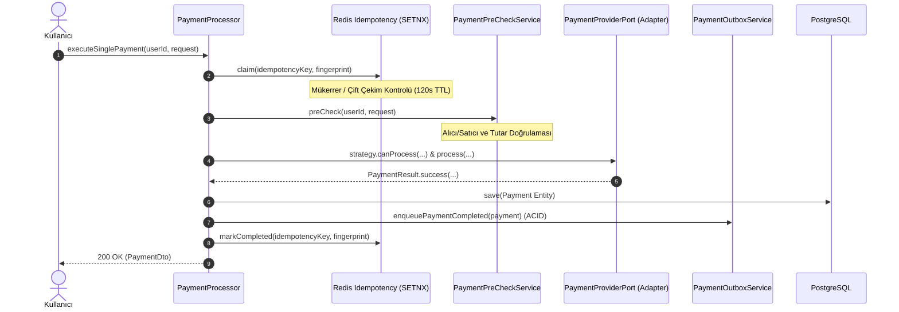

# Ödeme Strateji Deseni & Yeni Sağlayıcı Ekleme Rehberi (Payment Strategy & Extension Architecture)

Bu doküman, **secondHand** platformundaki ödeme altyapısının **Hexagonal Architecture (Port & Adapter)** ve **Strategy Pattern** prensipleriyle nasıl kurgulandığını, **Açık/Kapalı Prensibini (Open-Closed Principle - OCP)** ve sisteme **sıfır kod değişikliğiyle yeni bir ödeme sağlayıcısının (Stripe, İyzico, Kredi Kartı vb.)** nasıl entegre edileceğini adım adım açıklamaktadır.

---

## 1. Problem Tanımı ve Neden Strateji Deseni?

Monolitik veya kötü tasarlanmış ödeme sistemlerinde genellikle `PaymentService` içinde devasa `switch-case` veya `if-else` blokları bulunur:

```java
// ❌ KÖTÜ YAKLAŞIM (Anti-Pattern - OCP İhlali)
if ("EWALLET".equals(provider)) {
    processWallet();
} else if ("CREDIT_CARD".equals(provider)) {
    processCreditCard();
} else if ("IYZICO".equals(provider)) {
    processIyzico();
}
```

### Bu Yaklaşımın Zararları:
1. **Her Yeni Sağlayıcıda Mevcut Kodu Bozma Riski:** Yeni bir ödeme yöntemi eklerken mevcut çalışan ödeme metodunun kodunu değiştirmek regression hatalarına yol açar.
2. **SRP (Single Responsibility) İhlali:** `PaymentService` hem cüzdanı, hem kredi kartını, hem banka API'lerini bilmek zorunda kalır.
3. **Test Zorluğu:** Her sağlayıcının testini tek bir devasa servis içinde mock'lamak karmaşıklaşır.

---

## 2. Hexagonal Mimari ve Strateji Deseni (secondHand Çözümü)

```
[İstemci / PaymentRequest]
         │
         ▼
[PaymentProcessor] ──(Tüm Sağlayıcıları Enjekte Eder: List<PaymentProviderPort>)
         │
         ├───► [EWalletPaymentProviderAdapter] ──(supports: "EWALLET")
         ├───► [IyzicoPaymentProviderAdapter]   ──(supports: "IYZICO")
         ├───► [StripePaymentProviderAdapter]   ──(supports: "STRIPE")
         └───► [Gelecekteki Yeni Sağlayıcı...] ──(supports: "NEW_PROVIDER")
```

### A. Çekirdek Port Arayüzü: [`PaymentProviderPort.java`](file:///Users/serhat/IdeaProjects/secondHand/src/main/java/com/serhat/secondhand/payment/port/out/PaymentProviderPort.java)
Tüm ödeme sağlayıcıları bu sözleşmeyi (contract) uygular:

```java
public interface PaymentProviderPort {
    /** Bu adapter gelen sağlayıcı adını destekliyor mu? */
    boolean supports(String providerName);

    /** Kullanıcı ve bakiye/limit açısından ödeme yapılabilir mi? */
    boolean canProcess(User fromUser, User toUser, BigDecimal amount);

    /** Asıl ödeme tahsilat işlemini yürütür ve sonucu döner */
    PaymentResult process(User fromUser, User toUser, BigDecimal amount, UUID listingId, PaymentRequest request);
}
```

---

### B. Dinamik Yönlendirici (Orchestrator): [`PaymentProcessor.java`](file:///Users/serhat/IdeaProjects/secondHand/src/main/java/com/serhat/secondhand/payment/application/PaymentProcessor.java)

`PaymentProcessor`, Spring'in Dependency Injection yeteneğiyle kayıtlı tüm `PaymentProviderPort` bean'lerini otomatik listeler. Gelen istekteki `providerName` değerine göre doğru sağlayıcıyı O(1) hızında seçer:

```java
PaymentProviderPort strategy = providers.stream()
        .filter(p -> p.supports(paymentRequest.providerName()))
        .findFirst()
        .orElseThrow(() -> new IllegalArgumentException("No provider for: " + paymentRequest.providerName()));

if (!strategy.canProcess(context.fromUser(), context.toUser(), paymentRequest.amount())) {
    return Result.error("Payment Method is not eligible.", PaymentErrorCodes.PAYMENT_ERROR.toString());
}

PaymentResult result = strategy.process(context.fromUser(), context.toUser(), paymentRequest.amount(),
        paymentRequest.listingId(), paymentRequest);
```

---

## 3. Uçtan Uca Ödeme Yürütme Hattı (Execution Pipeline)

Bir ödeme isteği geldiğinde `PaymentProcessor` şu adımları sırayla işletir:



---

## 4. Adım Adım: Yeni Bir Ödeme Sağlayıcısı Nasıl Eklenir?

Örneğin sisteme **İyzico / Kredi Kartı** sağlayıcısını entegre etmek için izlenecek adımlar:

### Adım 1: Adapter Sınıfını Oluşturun
[`com.serhat.secondhand.payment.creditcard`](file:///Users/serhat/IdeaProjects/secondHand/src/main/java/com/serhat/secondhand/payment/creditcard) (veya ilgili alt paket) altında yeni sınıfı yazın:

```java
package com.serhat.secondhand.payment.creditcard;

import com.serhat.secondhand.payment.dto.PaymentRequest;
import com.serhat.secondhand.payment.entity.PaymentResult;
import com.serhat.secondhand.payment.port.out.PaymentProviderPort;
import com.serhat.secondhand.user.domain.entity.User;
import lombok.RequiredArgsConstructor;
import lombok.extern.slf4j.Slf4j;
import org.springframework.stereotype.Component;

import java.math.BigDecimal;
import java.util.UUID;

@Slf4j
@Component
@RequiredArgsConstructor
public class IyzicoPaymentProviderAdapter implements PaymentProviderPort {

    @Override
    public boolean supports(String providerName) {
        return "IYZICO".equalsIgnoreCase(providerName) || "CREDIT_CARD".equalsIgnoreCase(providerName);
    }

    @Override
    public boolean canProcess(User fromUser, User toUser, BigDecimal amount) {
        return amount != null && amount.compareTo(BigDecimal.ZERO) > 0;
    }

    @Override
    public PaymentResult process(User fromUser, User toUser, BigDecimal amount, UUID listingId, PaymentRequest request) {
        try {
            // 1. İyzico API istemcisi üzerinden 3D Secure / Direct Charge çağrısı yap
            String externalTransactionId = "IYZICO_TXN_" + UUID.randomUUID();
            
            // 2. Başarılı sonuç dön
            return PaymentResult.success(externalTransactionId);
        } catch (Exception ex) {
            log.error("Iyzico payment failed", ex);
            return PaymentResult.failed(ex.getMessage());
        }
    }
}
```

### Adım 2: Bitti! 🎉
* **`PaymentProcessor` veya başka hiçbir sınıfı değiştirmenize gerek yoktur.**
* `@Component` anatasyonu sayesinde Spring bu adapter'ı otomatik olarak `List<PaymentProviderPort>` listesine ekler.
* İstemci `providerName: "IYZICO"` gönderdiği andan itibaren tüm ödeme akışı bu yeni adapter üzerinden akar.

---

## 5. Ödeme Sonrası Yan Etki Deseni ([`PaymentCompletedHandler.java`](file:///Users/serhat/IdeaProjects/secondHand/src/main/java/com/serhat/secondhand/payment/application/PaymentCompletedHandler.java))

Ödeme tamamlandıktan sonra tetiklenecek işlemler de (Vitrin uzatma, ilan satın alma, komisyon kesme) yine Açık/Kapalı Prensibiyle yönetilir:

```java
public interface PaymentCompletedHandler {
    boolean supports(Payment payment);
    PaymentCompletedHandleResult handle(Payment payment);
}
```
* [`PaymentCompletedHandlerRegistry.java`](file:///Users/serhat/IdeaProjects/secondHand/src/main/java/com/serhat/secondhand/payment/application/PaymentCompletedHandlerRegistry.java) ödeme kaydını destekleyen doğru handler'ı dinamik olarak bularak işletir.

---

## 6. Yeni Sağlayıcıların Otomatik Kazandığı Altyapı Güvenceleri

| Güvenlik / Dayanıklılık Katmanı | Nasıl Çalışır? | Sağlayıcıya Faydası |
| :--- | :--- | :--- |
| **Redis Idempotency Lock** | İstek `PaymentProcessor`'a girdiği an `Idempotency-Key` başlığı kilitlenir. | Yeni eklenen sağlayıcıda çift çekim (double-charge) kodu yazmanıza gerek kalmaz. |
| **JPA Optimistic Lock Retry** | Eşzamanlı DB çakışmalarında `PaymentProcessor` 3 kez exponential backoff ile tekrar dener. | Concurrency yarış durumlarında otomatik kurtarma. |
| **Transactional Outbox & Kafka** | Ödeme başarılı olduğunda `PaymentOutboxService` üzerinden `payment.completed.v1` eventi yayınlanır. | E-posta, stok düşümü ve bildirimler asenkron olarak otomatik tetiklenir. |
| **Önbellek Tahliyesi (`@CacheEvict`)** | Ödeme bitince `paymentStats` cache'i otomatik temizlenir. | Dashboard ve istatistiklerin anında güncellenmesi. |
