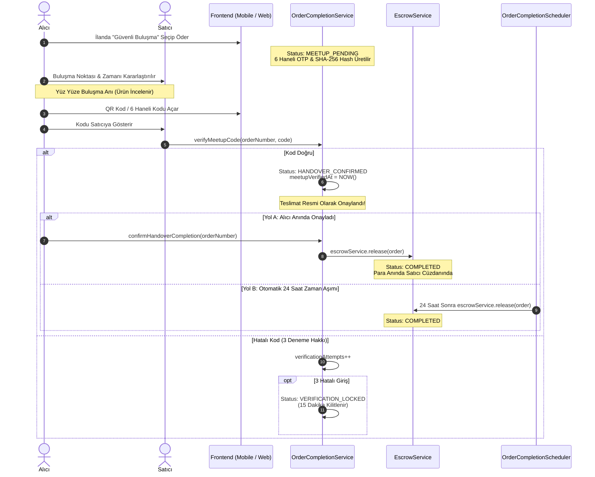

# Güvenli Buluşma (Safe Meetup) ve Yüz Yüze Teslimat Doğrulama Rehberi

Bu doküman, **secondHand** platformundaki **Güvenli Buluşma (Safe Meetup)** teslimat modelini, **SHA-256 Kriptografik OTP & QR Doğrulama Sistemini**, **Brute-Force Kilit Mekanizmasını (`VERIFICATION_LOCKED`)** ve **24 Saatlik Otomatik Tamamlama Yaşam Döngüsünü** detaylandırmaktadır.

---

## 1. Problem Tanımı ve Safe Meetup Güvenlik Modeli

İkinci el alışverişte kargo masrafından kaçınmak veya ürünü görerek almak isteyen kullanıcılar yüz yüze buluşmayı tercih eder. Ancak geleneksel elden teslimatta şu riskler oluşur:
1. **Nakit / Sahte Para Riski:** Elden nakit alışverişte sahte para veya gasp tehlikesi.
2. **"Ürünü Aldım Ama Almadım Dedi" Çelişkisi:** Kargo takip numarası olmadığı için alıcının teslim aldığı ürünü inkar etmesi veya satıcının ürünü vermeden "teslim ettim" demesi.
3. **Escrow Kilidi:** Kargo belgesi olmayan bir işlemde havuzdaki paranın satıcıya ne zaman ve nasıl aktarılacağı belirsizliği.

### secondHand Güvenli Buluşma Çözümü:
* **Ödeme Önceden Escrow'da:** Alıcı ödemeyi platform üzerinden yapar; para güvence havuzunda bloke edilir (`MEETUP_PENDING`).
* **Alıcıya Özel Dinamik OTP / QR Kod:** Alıcıya 6 haneli, 5 dakika geçerli bir teslimat doğrulama kodu ve QR kod verilir.
* **Fiziksel Teslim Anında Doğrulama:** Buluşma anında alıcı ürünü inceler, beğenirse kodu satıcıya gösterir. Satıcı kodu sisteme girdiğinde teslimat kesinleşir (`HANDOVER_CONFIRMED`).
* **Otomatik veya Anında Escrow Çözümü:** Teslimat onaylandığında satıcının cüzdanına bakiye aktarılır.

---

## 2. Uçtan Uca Güvenli Buluşma Sıralama Diyagramı



---

## 3. Durum Makinesi ve Güvenlik Seviyeleri

| Durum | Açıklama | Alıcı / Satıcı Aksiyonu |
| :--- | :--- | :--- |
| **`MEETUP_PENDING`** | Ödeme alındı, buluşma bekleniyor. | Alıcı kodu görüntüler; satıcı teslimata hazırlanır. İptal edilebilir. |
| **`VERIFICATION_LOCKED`** | Satıcı 3 kez üst üste yanlış kod girdi. | Sistem 15 dakika boyunca kilitlenir; brute-force engellenir. |
| **`HANDOVER_CONFIRMED`** | Kod doğrulandı; ürün fiziken el değiştirdi. | İptal edilemez. Alıcı hemen onaylayabilir veya 24 saat beklenir. |
| **`COMPLETED`** | Emanet havuzundaki para satıcının e-Cüzdanına aktarıldı. | *Terminal Durum* (Yorum & değerlendirme aşaması). |

---

## 4. Kritik Güvenlik ve Teknik Mekanizmalar

### A. Kriptografik Kod Güvenliği (SHA-256 Hashing)
* Kod veritabanında **açık metin (plain text) olarak saklanmaz**.
* Sipariş anında `Order.hashSha256(code)` ile hash'lenerek `meetupVerificationCodeHash` alanına yazılır.
* Satıcının girdiği kod hash'lenerek karşılaştırılır (`hashedInput.equals(order.getMeetupVerificationCodeHash())`).

---

### B. Zaman Aşımı & Yenileme Sınırları (Throttling)
* **Kod Geçerlilik Süresi:** Kod üretildikten sonra **5 dakika** içinde kullanılmalıdır (`MEETUP_CODE_EXPIRED`).
* **Yeniden Üretim Koruması (Rate Limit):** Alıcı yeni kod üretmek isterse (`regenerateMeetupCode`), spam'i önlemek için en az **30 saniye** beklemek zorundadır.

---

### C. Brute-Force Kaba Kuvvet Koruması (`VERIFICATION_LOCKED`)
[`OrderCompletionService.java`](file:///Users/serhat/IdeaProjects/secondHand/src/main/java/com/serhat/secondhand/order/application/OrderCompletionService.java) üzerinde:
```java
int newAttempts = order.getVerificationAttempts() + 1;
order.setVerificationAttempts(newAttempts);
if (newAttempts >= 3) {
    order.setStatus(OrderStatus.VERIFICATION_LOCKED);
    order.setVerificationLockedUntil(LocalDateTime.now().plusMinutes(15));
    orderRepository.save(order);
    return Result.error("Too many failed attempts. Verification locked for 15 minutes.", OrderErrorCodes.VERIFICATION_LOCKED.getCode());
}
```
* 3 başarısız denemede sipariş 15 dakika boyunca kilitlenir. 15 dakika sonra ilk başarılı denemede sayaç sıfırlanır.

---

### D. QR Kod ile Hızlı Doğrulama
* [`generateMeetupQrCode`](file:///Users/serhat/IdeaProjects/secondHand/src/main/java/com/serhat/secondhand/order/application/OrderCompletionService.java) servisi, alıcının doğrulama kodunu içeren dinamik bir QR kod bayt dizisi (`byte[]`) üretir.
* Satıcı mobil kamerasıyla QR kodu okuttuğunda kod otomatik olarak `verifyMeetupCode` endpoint'ine gönderilir; el ile yazma zahmeti ve hata payı ortadan kalkar.

---

### E. Otomatik Serbest Bırakma (24 Saatlik Garanti)
* Ürün elden teslim edilip `HANDOVER_CONFIRMED` statüsüne geçtikten sonra, alıcı eve gidip onay vermeyi unutursa satıcı mağdur edilmez.
* [`OrderCompletionScheduler.java`](file:///Users/serhat/IdeaProjects/secondHand/src/main/java/com/serhat/secondhand/order/application/OrderCompletionScheduler.java) tam **24 saat sonra** (`duration.toHours() >= 24`) devreye girerek siparişi tamamlar ve EscrowOutbox üzerinden satıcının hesabına parayı aktarır.

---

## 5. Hata ve Uyuşmazlık Senaryoları Matrisi

| Senaryo | Ne Olur? | Sistemin Çözümü |
| :--- | :--- | :--- |
| **Alıcı Buluşmaya Gelmedi** | Ürün teslim edilmedi, kod verilmedi. | Sipariş `MEETUP_PENDING` durumunda olduğu için alıcı veya satıcı siparişi iptal edebilir; para alıcıya iade edilir. |
| **Alıcı Ürünü Beğenmedi** | Fiziksel kontrolde kusur tespit edildi. | Alıcı kodu satıcıya **vermez**. Siparişi iptal eder; emanet havuzundaki para alıcı cüzdanına döner, satıcı ürününü geri alır. |
| **Satıcı Kodu Tahmin Etmeye Çalıştı** | Art arda denemeler yaptı. | 3. yanlış denemede sistem 15 dakika kilitlenir (`VERIFICATION_LOCKED`). |
| **İnternet Çekmeyen Kapalı Otopark / Metro** | Buluşma yerinde internet zayıf. | Alıcı önceden kodu veya QR kodu açıp ekran görüntüsü alabilir; satıcı internete çıktığı anda kodu girip doğrulayabilir. |
