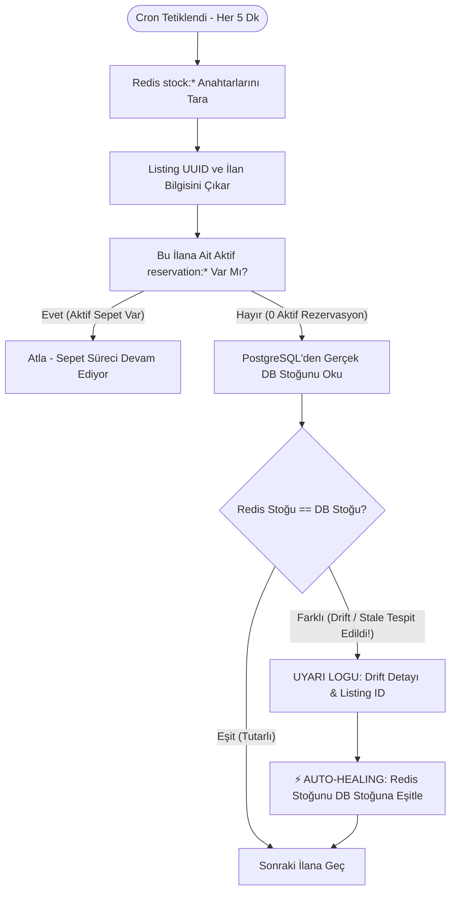

# Stok Rezervasyon ve Mutabakat (Reconciliation & Auto-Healing) Rehberi

Bu doküman, **secondHand** platformunda Redis In-Memory stok yönetimi ile PostgreSQL ACID veritabanı arasındaki **veri tutarlılığını (Data Consistency)**, **stale (bayat) veri onarımını** ve **Stock Reservation Reconciliation** mimarisini tüm senaryolarıyla detaylandırmaktadır.

---

## 1. Problem Tanımı ve İkili Durum (Dual-State) Riski

İkinci el platformlarında ve flash-sale senaryolarında iki temel zıt gereksinim bulunur:
1. **Ultra Hızlı Yanıt (Sub-millisecond Concurrency):** Yüzlerce kullanıcının aynı anda sepete ekleme ve satın alma denemelerinde veritabanı satır kilitleri (`SELECT FOR UPDATE`) connection pool'u tüketir ve latency yaratır. Bu yüzden stok kontrolleri **Redis** üzerinde in-memory yapılır.
2. **Kesin Finansal ve Fiziksel Tutarlılık (ACID Ground-Truth):** Satılan ürünün yasal, muhasebesel ve envanter kaydı **PostgreSQL** veritabanında saklanır.

### Olası Tutarsızlık (Drift & Stale Data) Senaryoları:
* **Senaryo A (Kullanıcı Sepeti Terk Etti / TTL Doldu):** Kullanıcı ürünü sepete eklediğinde Redis'te stok 1 azaltılır ve 15 dakikalık TTL verilir. Kullanıcı sepeti terk ederse `reservation:*` anahtarı TTL bitiminde silinir; fakat Redis `stock:*` anahtarı ile DB stoğu arasında senkron farkı kalabilir.
* **Senaryo B (Sunucu Çökmesi / Pod Restart):** Redis'te rezervasyon yapıldıktan sonra ödeme aşamasında pod restart olursa veya network koparsa, rezervasyon askıda (orphaned) kalabilir.
* **Senaryo C (Kayıp Satış Riski - Under-Selling):** PostgreSQL'de 1 adet fiziksel stok olmasına rağmen Redis'te stok `0` göründüğü için potansiyel alıcılar "Stok Yetersiz" hatası alır.
* **Senaryo D (Aşırı Satış Riski - Over-Selling):** PostgreSQL'de stok `0` olmasına rağmen Redis'te `1` görünürse iki farklı kullanıcıya aynı ürün satılabilir.

---

## 2. Mimari Akış ve İkili Doğrulama (Dual-State Verification)



---

## 3. Bileşen Analizi ve Kod İncelemesi

### A. [`StockReservationReconciliationScheduler.java`](file:///Users/serhat/IdeaProjects/secondHand/src/main/java/com/serhat/secondhand/inventory/application/StockReservationReconciliationScheduler.java)

Bu servis, arka planda periyodik olarak çalışan bir **Watchdog / Healer** mekanizmasıdır.

```java
@Scheduled(fixedDelayString = "${app.inventory.reconciliation.fixed-delay-ms:300000}", initialDelay = 60000)
public void reconcileOrphanedStockReservations() {
    // 1. Redis'teki tüm stok anahtarlarını bul
    Set<String> stockKeys = redisTemplate.keys("stock:*");
    
    for (String stockKey : stockKeys) {
        UUID listingId = UUID.fromString(stockKey.replace("stock:", ""));

        // 2. Bu ilana ait devam eden aktif kullanıcı rezervasyonlarını topla
        Set<String> activeReservations = redisTemplate.keys("reservation:*:" + listingIdStr);
        int totalReservedInRedis = calculateTotalReservations(activeReservations);

        // 3. Eğer ürüne ait hiçbir aktif sepet/rezervasyon kalmamışsa:
        // Redis'teki stok KESİNLİKLE PostgreSQL availableQuantity'ye eşit olmalıdır!
        if (totalReservedInRedis == 0) {
            inventoryRepository.findByListingId(listingId).ifPresent(inventory -> {
                int dbStock = inventory.getAvailableQuantity();
                String currentRedisVal = redisTemplate.opsForValue().get(stockKey);
                
                if (currentRedisVal != null && Integer.parseInt(currentRedisVal) != dbStock) {
                    log.warn("⚡ [STOCK RECONCILIATION] Listing {} stock drift detected! Redis: {}, DB: {}. Auto-healing Redis stock.",
                            listingId, currentRedisVal, dbStock);
                    
                    // 4. Redis'teki bayat veriyi DB gerçeği ile güncelle
                    redisTemplate.opsForValue().set(stockKey, String.valueOf(dbStock));
                }
            });
        }
    }
}
```

---

## 4. Anahtar ve Durum Yönetimi Tablosu

| Anahtar Tipi | Örnek Anahtar | TTL Süresi | Görevi / Anlamı |
| :--- | :--- | :--- | :--- |
| **Stok Sayacı** | `stock:e2b3c4...` | TTL'siz (veya LRU) | O an sepette olmayan, satın alınabilir net stok miktarı. |
| **Kullanıcı Rezervasyonu** | `reservation:105:e2b3c4...` | 15 Dakika (900s) | `105` ID'li kullanıcının ödeme adımında tuttuğu adet. |
| **DB Envanteri** | PostgreSQL `inventories` | Kalıcı (ACID) | Nihai fiziksel ve onaylanmış stok (Tek Doğruluk Kaynağı - Single Source of Truth). |

---

## 5. Tüm Durum ve Hata Senaryoları Matrisi

| Senaryo | Ne Oldu? | Anlık Durum | Reconciliation Nasıl Çözer? |
| :--- | :--- | :--- | :--- |
| **1. Başarılı Ödeme** | Kullanıcı ödedi, Outbox Kafka'ya iletti, DB stoğu 1'den 0'a düştü. | Redis: 0, DB: 0, Rezervasyon: Silindi. | Tutarlı. Her iki taraf da `0`, müdahale gerekmez. |
| **2. Sepeti Terk Etme (Normal)** | Kullanıcı sepetten çıktı veya 15 dk bekledi. | `reservation:*` TTL ile silindi. | Rezervasyon toplamı `0` olunca, Redis stoğu DB'deki `1` değerine otomatik eşitlenir. |
| **3. Ağ Kesintisi / Pod Crash** | Redis'te stok düşüldü ama ödeme servisine ulaşılamadı. | Redis: 0, DB: 1, Rezervasyon: TTL doldu. | Scheduler TTL bitiminde drift'i yakalar; Redis stoğunu `1` yaparak ilanı tekrar satışa açar (Kayıp Satış Önlenir). |
| **4. Manuel DB Müdahalesi** | Yönetici panelinden ürün stoğu veritabanında güncellendi. | Redis: Eski Değer, DB: Yeni Değer. | Scheduler en geç 5 dakika içinde Redis anahtarını DB'deki yeni miktara çeker. |

---

## 6. Operasyonel ve Performans Tavsiyeleri

1. **Çok Yüksek Veri Hacminde `SCAN` Kullanımı:**
   * Küçük/orta ölçekte `keys("stock:*")` yeterli ve pratiktir. Milyonlarca aktif anahtarın bulunduğu devasa cluster yapılarında Redis'i bloklamamak için `SCAN` cursor komutuna geçiş yapılabilir.
2. **Yapılandırma Parametreleri ([`application-core.yml`](file:///Users/serhat/IdeaProjects/secondHand/src/main/resources/config/application-core.yml)):**
   * `app.inventory.reconciliation.fixed-delay-ms: 300000` (Varsayılan 5 dakika; ihtiyaca göre 1-10 dakika arasına ayarlanabilir).
   * `initialDelay: 60000` (Uygulama açıldıktan 1 dakika sonra ilk mutabakatı yapar).
3. **Log & Metrik Takibi:**
   * Kibana veya Grafana üzerinden `⚡ [STOCK RECONCILIATION]` logları izlenerek hangi ürünlerde ne sıklıkla drift yaşandığı raporlanabilir.
