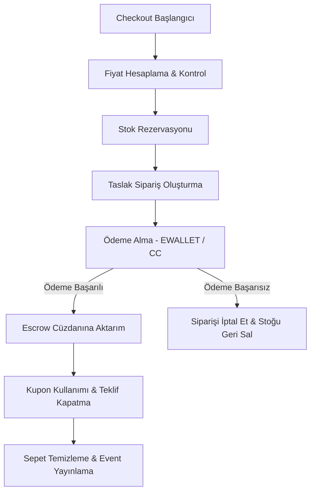

# Checkout (Satın Alma / Ödeme Kontrolü) Modülü

Bu modül, sepet veya teklif üzerinden başlayan satın alma işlemlerini yöneten koordinasyon (Orchestration) katmanıdır. Sepet doğrulamasından ödeme alınması, kargo kaydının oluşturulması ve emanet hesaba (Escrow) paranın aktarılmasına kadar olan tüm süreci yönetir.

## Agent Note
> [!IMPORTANT]
> Detaylı AI ajan kuralları ve proje mimari haritası için: `.agents/PROJECT_REPORT.md` ve `GEMINI.md` dosyalarını oku.

## İş Akışı ve Koordinasyon (`CheckoutOrchestrator`)

`executeCheckout` metodunun başlattığı satın alma akışı sırasıyla aşağıdaki adımlardan oluşur:

### 1. Fiyatlandırma Bağlamı (`CheckoutPricingContextFactory`)
- Kullanıcının aktif sepet öğelerini, varsa kabul edilen teklifleri (`acceptedOffer`) ve kupon kodlarını çekerek son fiyatlandırmayı hesaplar.

### 2. Stok Rezervasyonu (`CheckoutStockReservationService`)
- Satın alınmak istenen ürünlerin stoklarını kontrol eder ve rezerve eder.
- İşlem başarısız olursa veya ödeme alınamazsa, rezerve edilen stoklar otomatik olarak geri bırakılır (`releaseReservedStock`).

### 3. Sipariş Oluşturma (`OrderCreationService`)
- Alıcı bilgileri, teslimat yöntemi (Safe Meetup veya Kargo) ve hesaplanan fiyat detaylarıyla sipariş kaydı oluşturur.

### 4. Ödeme Yönetimi (`OrderPaymentService`)
- Siparişin türüne göre entegre cüzdandan (E-Wallet) veya kredi kartından ödeme tahsil eder.
- Ödeme başarısız olursa, sipariş iptal durumuna getirilir ve stok iade edilir.

### 5. Emanet Hesap Altyapısı (`EscrowService`)
- Ödemesi başarılı olan siparişlerin tutarı doğrudan satıcıya aktarılmaz; alıcı teslimatı onaylayana kadar sistemin emanet (Escrow) hesabında bekletilir.

### 6. Event Yayınlama (`ApplicationEventPublisher`)
- Süreç tamamlandığında asenkron işlenmek üzere `OrderCreatedEvent` yayınlanır.
