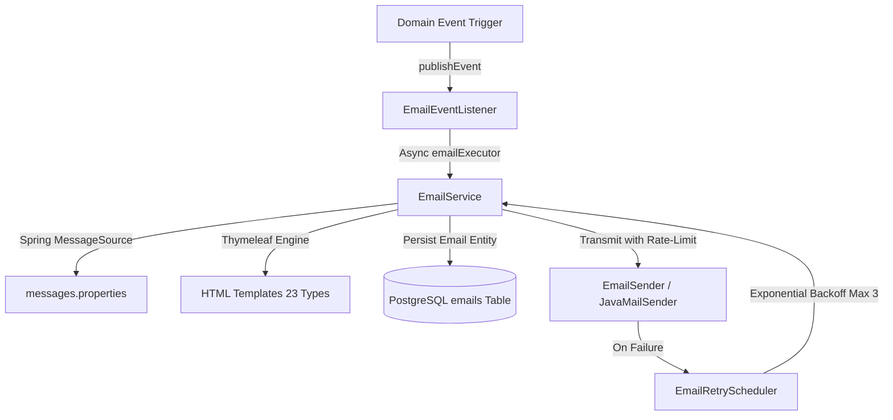

# Email Domain

## 1. Purpose & Architecture Overview
The `email` domain manages the end-to-end asynchronous creation, localization (i18n), Thymeleaf HTML rendering, SMTP/mock delivery, persistent status tracking, and automated exponential backoff retries across the entire SecondHand platform.

## 2. Asynchronous Thread Pool & Lifecycle
- **Executor (`emailExecutor`):** Configured in `AsyncConfig.java` with 5 core threads, 20 max threads, 500 queue capacity, and `CallerRunsPolicy` to prevent message loss under traffic bursts.
- **Transactional Listener (`EmailEventListener`):**
  - Listens to `SendEmailEvent` using `@TransactionalEventListener(phase = TransactionPhase.AFTER_COMMIT, fallbackExecution = true)`.
  - Runs in background thread via `@Async("emailExecutor")` ensuring zero latency impact on core business transactions.
- **Persistence & Auditing:**
  - All outbound emails are tracked in the `emails` table with statuses: `PENDING`, `SENT`, `FAILED` and priorities: `CRITICAL`, `HIGH`, `NORMAL`, `LOW`.
- **Automated Retry Scheduler (`EmailRetryScheduler`):**
  - Runs every 5 minutes (`0 */5 * * * *`).
  - Automatically queries failed emails with `retryCount < 3` and re-attempts delivery using exponential backoff: `Math.pow(2, retryCount) * 5` minutes.
  - Daily purge at 02:00 deletes email logs older than 30 days.

## 3. All 23 Email Notification Types & Template Catalog
| Category | EmailType Enum | Thymeleaf Template Path | Triggering Domain / Service |
| :--- | :--- | :--- | :--- |
| **Auth & Profile** | `VERIFICATION` | `emails/notifications/verification-code.html` | User registration & 2FA |
| | `PASSWORD_RESET` | `emails/notifications/password-reset.html` | Password recovery requests |
| | `WELCOME` | `emails/notifications/welcome.html` | User registration completion |
| | `PHONE_UPDATE` | `emails/notifications/phone-update.html` | Profile phone change verification |
| **Orders & Sales** | `ORDER_CONFIRMATION` | `emails/orders/confirmation.html` | Order placement & escrow lock |
| | `ORDER_CANCELLED` | `emails/orders/cancelled.html` | Order cancellation |
| | `ORDER_COMPLETED` | `emails/orders/completed.html` | Delivery confirmation & escrow release |
| | `ORDER_REFUNDED` | `emails/orders/refunded.html` | Order refund processed |
| | `SALE_NOTIFICATION` | `emails/orders/sale-notification.html` | Item sold seller alert (Shipping/Meetup PIN) |
| **Offers & Negotiations**| `OFFER_RECEIVED` | `emails/offers/received.html` | Buyer places an offer |
| | `OFFER_COUNTER` | `emails/offers/counter.html` | Seller/Buyer responds with counter-offer |
| | `OFFER_ACCEPTED` | `emails/offers/accepted.html` | Offer accepted by party |
| | `OFFER_REJECTED` | `emails/offers/rejected.html` | Offer declined |
| | `OFFER_EXPIRED` | `emails/offers/expired.html` | Offer TTL expires |
| | `OFFER_COMPLETED` | `emails/offers/completed.html` | Offer converted into paid order |
| **Payments & Escrow** | `PAYMENT_SUCCESS` | `emails/payments/success.html` | Successful deposit/escrow charge |
| | `PAYMENT_RECEIPT` | `emails/payments/receipt.html` | Payment receipt with amounts |
| | `PAYMENT_VERIFICATION` | `emails/payments/verification.html` | Payment 3DS / 2FA check |
| **Social & System** | `NEW_LISTING` | `emails/notifications/new-listing.html` | Followed seller publishes a listing |
| | `PRICE_CHANGE` | `emails/notifications/price-change.html` | Favorite listing price discount |
| | `AGREEMENT_UPDATE` | `emails/notifications/agreement-update.html` | Legal terms / agreements updated |
| | `GREAT_SELLER` | `emails/system/great-seller.html` | Great Seller badge qualification |
| | `MEMBERSHIP_ACTIVATION`| `emails/system/membership.html` | Premium membership plan purchase |
| | `AUDIT_ALERT` | `emails/system/audit.html` | Security / suspicious activity notice |

## 4. Internationalization (i18n) & Configuration Rules
- **No Hardcoded Texts in Config:** All email subjects, greeting formats, and action labels reside strictly in `messages.properties` (TR) and `messages_en.properties` (EN).
- **Application Config (`application-email.yml`):** Contains only operational infrastructure properties (`spring.mail.*`, `app.email.mock`, `app.email.sender`).
- **Dynamic Localization:** `EmailConfig.java` resolves subjects dynamically based on the user's active locale via `LocaleContextHolder` and `MessageSource`.

