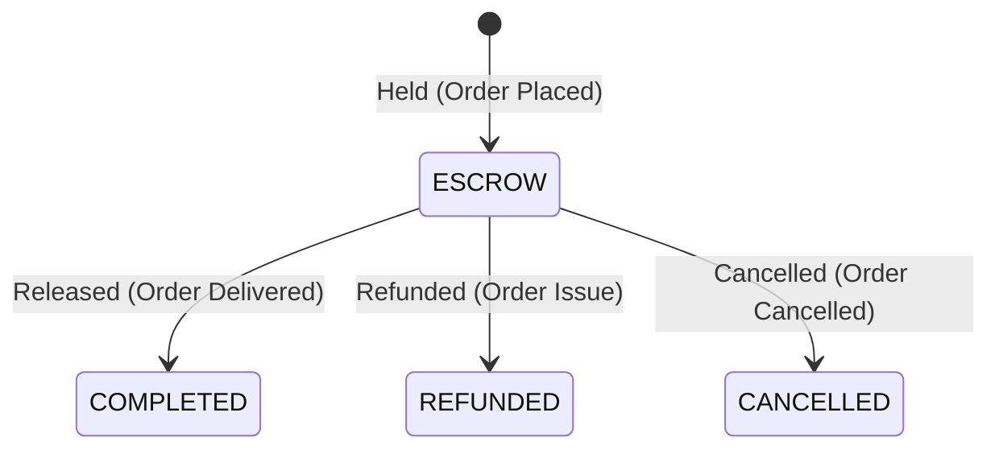

# Escrow Domain

## Purpose
The `escrow` domain manages the "safe trade" fund flow, securing funds from the buyer and releasing them to the seller only after delivery confirmation.

## Architecture Overview
- **EscrowService:** Core service that coordinates hold, release, and refund logic.
- **Unified Payment Record:** The escrow system shares records with the `payment` domain rather than duplicating them. A payment with `status=ESCROW` serves as the escrow record.

## Business Invariants & Constraints
- **Unified Ledger:** Escrow holding does not create a new `Payment` record; it relies on the `PaymentProcessor` setting the status to `ESCROW`.
- **Release Semantics:** Releasing escrow transitions the payment status to `COMPLETED` and updates the seller's wallet silently (`creditWalletQuietly`).
- **Refund Window:** Escrow can only be refunded/cancelled *before* it is released. Once released, the funds belong to the seller and cannot be refunded by the escrow system.
- **Refund Destination:** Escrow refunds are routed back to the buyer's system wallet, never involving the seller.

## State Machine

## Integration Points
- **Incoming:** Triggered heavily by the `order` domain during checkout and delivery lifecycle.
- **Outgoing:** Triggers `PaymentCompletedEvent` upon release. Interacts directly with `payment` repository.

## Public APIs
- None directly exposed. Triggered internally via domain events or inter-service coordination.

## Related Knowledge
- **Modify Escrow Behavior**
  -> `.docs/runbooks/modify-escrow-behavior.md`
