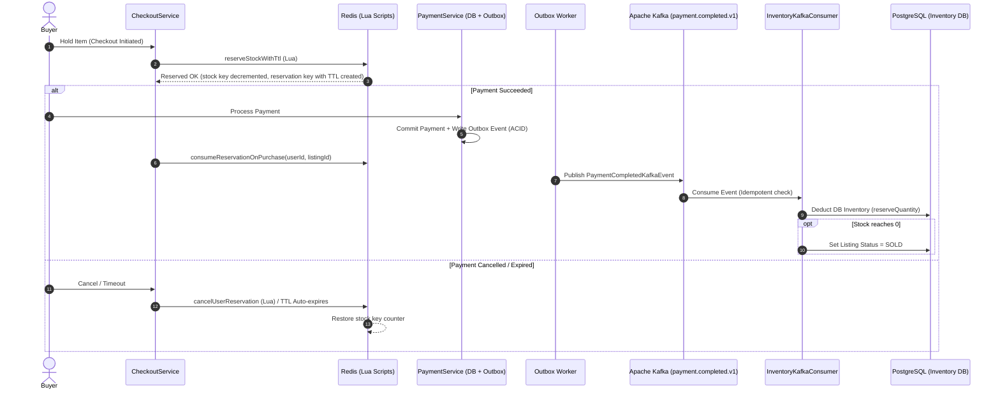

# Inventory Domain

## 1. Purpose & Problem Statement
In high-concurrency second-hand e-commerce environments, standard relational database row-locking (`SELECT FOR UPDATE`) causes database connection starvation, latency spikes, and deadlocks when multiple buyers attempt to purchase or hold the same product simultaneously.

The `inventory` domain implements a **High-Performance Distributed Stock Reservation Engine** combining:
- **Redis In-Memory Lua Scripting** for sub-millisecond atomic checks, reservations, and anti-hoarding TTLs.
- **Transactional Outbox & Apache Kafka** for reliable, asynchronous eventual consistency to PostgreSQL.
- **Background Reconciliation** for drift prevention and fault recovery.

---

## 2. Architecture & Component Roles

### Core Components
1. **[InventoryRedisReservationService](file:///Users/serhat/IdeaProjects/secondHand/src/main/java/com/serhat/secondhand/inventory/application/InventoryRedisReservationService.java):**
   - Coordinates in-memory stock states.
   - Executes atomic Lua scripts so that balance check, decrement, and user reservation binding occur in a single atomic Redis operation.
2. **[InventoryService](file:///Users/serhat/IdeaProjects/secondHand/src/main/java/com/serhat/secondhand/inventory/application/InventoryService.java):**
   - Manages physical PostgreSQL `inventory` entity state, reserved quantities, and available balances.
3. **[InventoryKafkaConsumer](file:///Users/serhat/IdeaProjects/secondHand/src/main/java/com/serhat/secondhand/inventory/application/InventoryKafkaConsumer.java):**
   - Asynchronously consumes `payment.completed.v1`.
   - Performs DB-level idempotency via `ProcessedKafkaEventRepository`.
   - Finalizes stock deduction in PostgreSQL and transitions listings to `SOLD` if stock hits zero.
4. **[StockReservationReconciliationScheduler](file:///Users/serhat/IdeaProjects/secondHand/src/main/java/com/serhat/secondhand/inventory/application/StockReservationReconciliationScheduler.java):**
   - Scheduled watchdog that syncs Redis caches with PostgreSQL ground-truth inventory to heal anomalies from unexpected server restarts.

---

## 3. Redis Key Structure & Lua Scripts

### Key Namespaces
- **Stock Counter:** `stock:{listingId}` — Stores the currently unreserved available stock in Redis.
- **User Reservation:** `reservation:{userId}:{listingId}` — Stores the quantity reserved by a specific user with an explicit TTL (default 15 minutes / 900s).

### Lua Scripts ([src/main/resources/scripts/](file:///Users/serhat/IdeaProjects/secondHand/src/main/resources/scripts/))
| Script | Purpose | Arguments / Logic |
| :--- | :--- | :--- |
| `reserve_stock_with_ttl.lua` | Atomically verifies stock $\ge$ requested quantity. Initializes from DB fallback if Redis key is missing. Decrements `stock:{listingId}` and writes `reservation:{userId}:{listingId}` with `EXPIRE`. | Returns remaining stock or `-1` if insufficient. |
| `cancel_user_reservation.lua` | Reads reserved quantity from `reservation:{userId}:{listingId}`, deletes the key, and atomically increments `stock:{listingId}` back. | Returns restored amount or `0`. |
| `release_stock.lua` | Simple atomic increment of `stock:{listingId}` for general release. | Returns new stock count. |
| `reserve_stock.lua` | Simple non-TTL reservation fallback. | Returns remaining stock or `-1`. |

---

## 4. Invariants & Guarantees

1. **Zero Over-Selling Guarantee:** Stock checks and decrements are single-threaded atomic operations inside Redis via Lua scripts.
2. **Anti-Hoarding / TTL Expiration:** In-memory holds automatically expire after 15 minutes, freeing the item for other buyers if checkout is abandoned.
3. **At-Least-Once Delivery & Idempotent Consumption:** Kafka delivers events with at-least-once semantics. Consumer utilizes `ProcessedKafkaEvent` (`INSERT ON CONFLICT DO NOTHING`) to guarantee strictly exactly-once stock deductions.
4. **Automatic Sold-Out Transition:** If stock reaches `0` after DB deduction, the listing status is automatically flipped to `ListingStatus.SOLD`.
