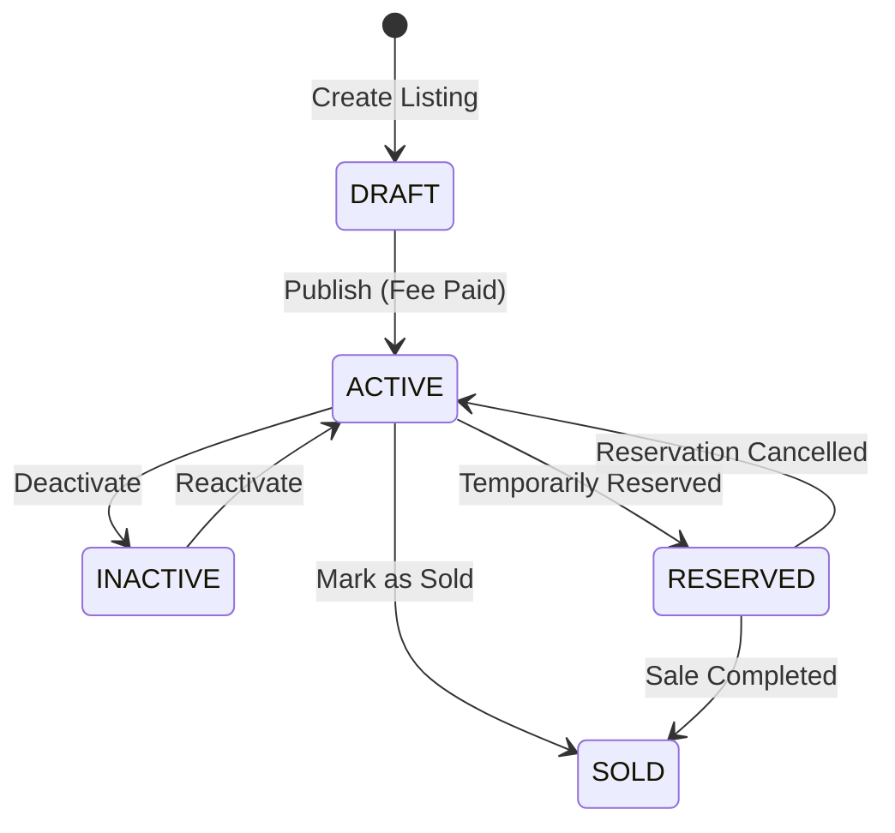

# Listing Domain

## Purpose
The `listing` domain is the core catalog engine. It manages the creation, validation, lifecycle (publish, deactivate, sell), searching, filtering, and statistical tracking of items across 6 distinct categories (Vehicle, Electronics, Books, Clothing, Real Estate, Sports).

## Architecture Overview
- **Rich Domain Model:** `Listing` entity encapsulates state-changing business rules (`publish()`, `deactivate()`, `updatePrice()`).
- **CQRS Separation:** Write operations (`ListingCommandService`) are segregated from complex read operations (`ListingQueryService`, `ListingSearchService`).
- **Ports & Adapters (Hexagonal):** Interactions with `payment` are abstracted through `ListingFeePaymentPort` and `PaymentModuleAdapter`.
- **AOP:** Price history changes are automatically tracked via `@TrackPriceChange` aspects.
- **Asynchronous Execution:** View tracking (`ListingViewService`) and read enrichment (fetching favorites/reviews) are executed asynchronously.

## Business Invariants & Constraints
- **State Validation:** A listing cannot be published unless its status is `DRAFT` or `INACTIVE` and any required listing fees are paid.
- **Polymorphism:** Category-specific data must inherit from the base `Listing` entity using the `JOINED` inheritance strategy.
- **Ownership Security:** Mutations (update, deactivate, mark sold) mandate strict ownership validation (`validateOwnership()`) in the domain logic.
- **Event Emission:** `NewListingCreatedEvent` is published exclusively after a successful transition to the `ACTIVE` state.
- **Decoupling:** `listing` must never directly depend on `payment` implementation details; it relies on ports.

## State Machine

## Integration Points
- **Incoming:** None directly (acts as a core source of truth).
- **Outgoing:** Payment Domain (via Adapter for listing fees), Follow/Notification (publishes events on new listings or price drops).

## Public APIs (Logical)
- CRUD for Base Listings and Specific Categories
- Search & Dynamic Criteria Filtering
- View Tracking & Aggregated Statistics
- Price History Queries

## Related Knowledge
- **Listing Data Flows**
  -> `.docs/knowledge/listing-data-flows.md`

- **Listing Architecture Patterns**
  -> `.docs/knowledge/listing-architecture-patterns.md`
