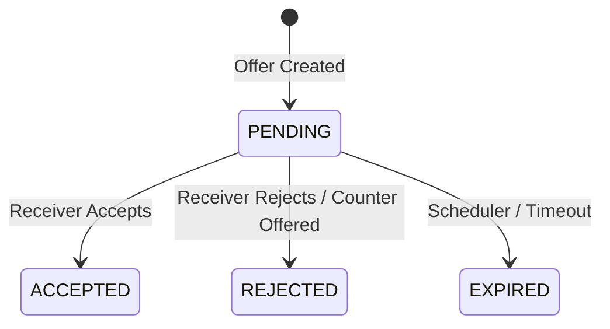

# Offer Domain

## Purpose
The `offer` domain manages buyer-to-seller negotiations (offers) on listings, including creation, acceptance, rejection, counter-offers, and expiration lifecycles.

## Architecture Overview
- **OfferService:** Orchestrates the complex lifecycle, actor validation, and concurrency control.
- **OfferScheduler:** Periodically scans for expired pending offers to transition their state.
- **EmailNotificationService:** Broadcasts lifecycle events (e.g., offer accepted) to users.

## Business Invariants & Constraints
- **Concurrency Lock:** Accepting an offer requires acquiring a lock on the Listing (`findByIdWithLock`) to ensure multiple offers cannot be simultaneously accepted for the same item.
- **Offer Chains:** Counter-offers establish a `parentOffer` link to maintain negotiation history. The parent offer must be explicitly rejected before creating the counter.
- **Authorization:** Only the explicitly designated receiver of an offer may accept or reject it.

## State Machine

## Integration Points
- **Incoming:** Triggered by HTTP requests from buyers and sellers.
- **Outgoing:** Queries the `listing` domain to validate listing status. Sends emails via the notification infrastructure.

## Public APIs
- `/api/offers/create`, `/api/offers/{id}/accept`, `/api/offers/{id}/reject`, `/api/offers/{id}/counter`

## Related Knowledge
- **Modify Offer Behavior**
  -> `.docs/runbooks/modify-offer-behavior.md`
