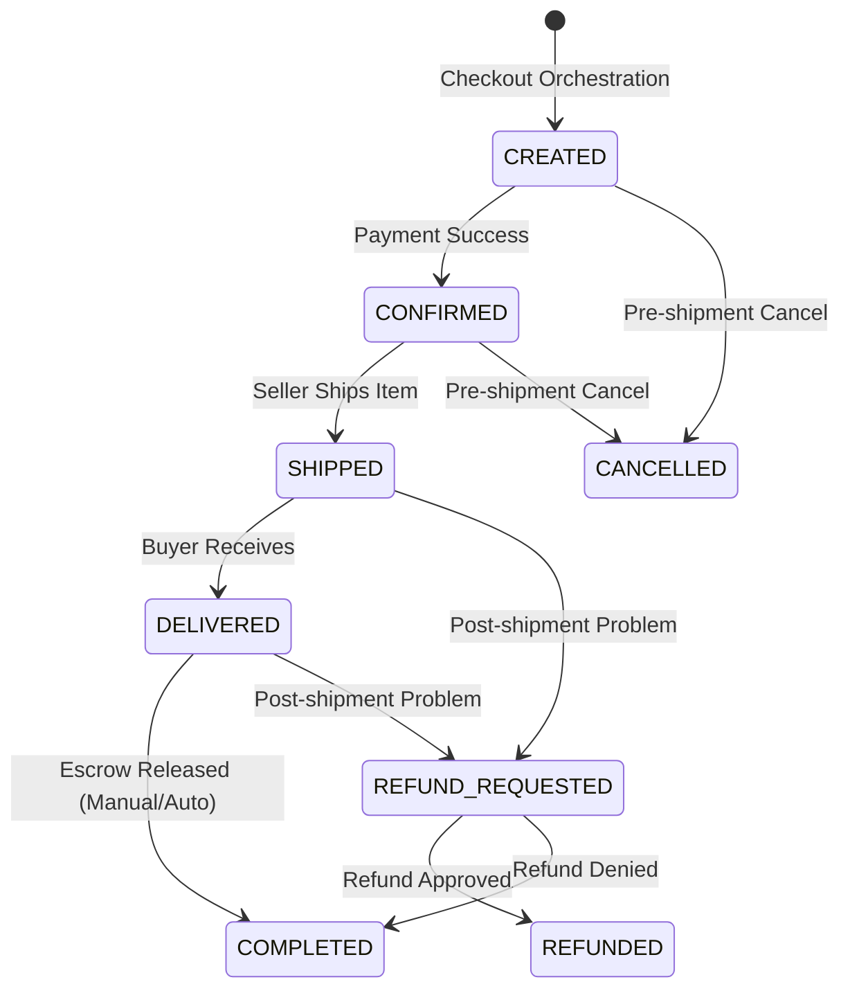

# Order Domain

## Purpose
The `order` domain manages the end-to-end lifecycle of a purchase: order creation, state progression, completion, cancellation, refund, and escrow resolution.

## Architecture Overview
- **Rich Domain Model:** The `Order` entity centralizes core state transition logic.
- **Policy Engine:** `policy` classes govern the validity of state transitions (e.g., is this order eligible for cancellation?).
- **Service Orchestration:** Application services (`OrderCreationService`, `OrderModificationService`) execute policies and coordinate repositories.
- **Automated Progression:** `OrderCompletionScheduler` automatically advances order states based on time thresholds.
- **AOP Logging:** `OrderLogAspect` intercepts and logs all API requests and mutations.

## Business Invariants & Constraints
- **Policy Centricity:** Invalid state transitions must be rejected by policy rules, not by service-level checks.
- **Escrow Dependency:** Order completion cannot be finalized unless the underlying escrow release operation is successful.
- **Item-Based Compensation:** Order cancellation and refund decisions mandate an item-by-item compensation plan (`OrderItemCompensationPlanner`).
- **Post-Commit Side Effects:** Event emissions (`OrderCancelledEvent`, `OrderRefundedEvent`) happen strictly after the core order transaction has committed.
- **Payment Orchestration:** `order` makes the decision to refund or cancel, but the execution of fund transfers is delegated to the `payment` orchestrator.

## State Machine

## Integration Points
- **Incoming:** Checkout Domain (triggers order creation).
- **Outgoing:** Payment Domain (called for escrow release/refund execution), Shipping Domain (called for tracking updates).
- **Events:** Publishes `OrderCancelledEvent`, `OrderRefundedEvent`, etc.

## Related Knowledge
- **Modify State Rule**
  -> `.docs/runbooks/modify-state-rule.md`

- **Modify Refund/Cancellation Behavior**
  -> `.docs/runbooks/modify-refund-behavior.md`

- **Add Order Endpoint**
  -> `.docs/runbooks/add-order-endpoint.md`

- **Order Feature Development**
  -> `.docs/runbooks/order-feature-runbook.md`

- **Order Testing Guidelines**
  -> `.docs/runbooks/order-testing-guidelines.md`
