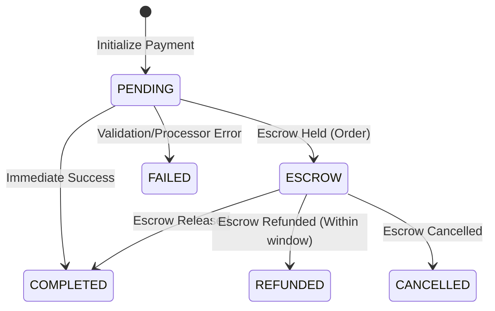

# Payment Domain

## Purpose
The `payment` domain provides the core payment processing engine: pre-check validation, strategy selection, payment recording, transactional event publishing, and escrow fund flow orchestration.

## Architecture Overview
- **PaymentProcessor:** Central entry point handling idempotency and dispatching to strategies.
- **PaymentPreCheckService:** Validates agreements, user eligibility, and OTP verification codes before transaction execution.
- **PaymentStrategy:** Strategy pattern implementation for different payment methods.
- **Transactional Outbox:** Ensures reliable event delivery (`PaymentCompletedEvent`) by writing events to an outbox table within the same transaction.
- **Escrow Orchestration:** Manages funds held in escrow until order completion or cancellation.

## Business Invariants & Constraints
- **Idempotency:** The combination of `idempotencyKey + fromUserId` guarantees a payment is processed exactly once. Repeat requests safely return the existing `orderId` and `status` without repeating side effects.
- **Idempotency Scope:** Idempotency rules must reside entirely within `PaymentProcessor` and not leak into individual strategies.
- **Verification Rule:** A payment requiring OTP verification cannot be finalized until the `verificationCode` is successfully validated during pre-check.
- **Event Dispatching:** All domain side-effects (e.g., notifications, ledger updates) execute via handlers triggered by `PaymentCompletedEvent` in the `AFTER_COMMIT` transaction phase.
- **Escrow Refund Window:** Refunds from escrow are only permitted within `REFUND_WINDOW_HOURS=48h`.
- **Escrow Auto-Completion:** Escrow auto-completes after `AUTO_COMPLETION_HOURS=72h`.

## State Machine

## Integration Points
- **Incoming:** Order Domain (initiates escrow payments), Checkout Domain (initiates immediate payments).
- **Outgoing:** Notification Domain (listens to completion events), User Domain (listens to ledger/wallet updates).

## Related Knowledge
- **Add Payment Strategy**
  -> `.docs/runbooks/add-payment-strategy.md`

- **Add Event Handler**
  -> `.docs/runbooks/add-event-handler.md`

- **Payment Feature Development**
  -> `.docs/runbooks/payment-feature-runbook.md`
