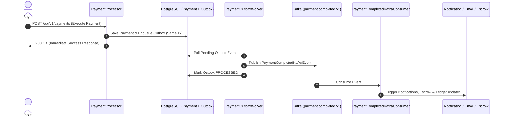
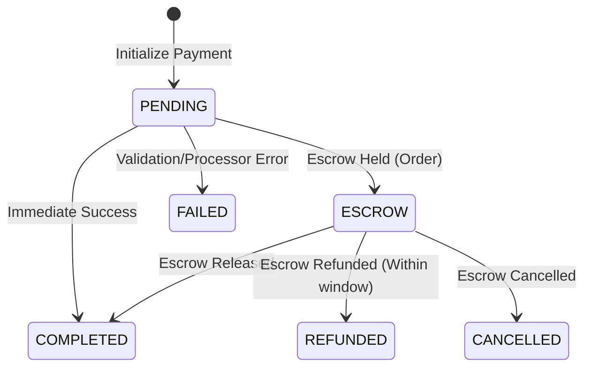

# Payment Domain

## Purpose
The `payment` domain provides the core payment processing engine: pre-check validation, strategy selection, payment recording, transactional event publishing, and escrow fund flow orchestration.

## Architecture Overview
- **PaymentProcessor:** Central entry point handling idempotency and dispatching to payment strategies.
- **PaymentPreCheckService:** Validates agreements, user eligibility, and OTP verification codes before transaction execution.
- **PaymentStrategy:** Strategy pattern implementation for different payment methods.
- **Transactional Outbox + Kafka:** Ensures guaranteed, at-least-once event delivery (`PaymentCompletedKafkaEvent`) by first saving events to the `payment_outbox` table within the payment transaction, and then publishing them asynchronously to Kafka via `PaymentKafkaProducer` and `PaymentOutboxWorker`.
- **PaymentCompletedKafkaConsumer:** Asynchronously listens to `payment.completed.v1` topic to trigger notifications, order updates, and escrow operations with zero impact on payment API latency.
- **Escrow Orchestration:** Manages funds held in escrow until order completion or cancellation.

## Business Invariants & Constraints
- **Idempotency:** The combination of `idempotencyKey + fromUserId` guarantees a payment is processed exactly once. Repeat requests safely return the existing `orderId` and `status` without repeating side effects.
- **Idempotency Scope:** Idempotency rules must reside entirely within `PaymentProcessor` and not leak into individual strategies.
- **Verification Rule:** A payment requiring OTP verification cannot be finalized until the `verificationCode` is successfully validated during pre-check.
- **Event-Driven Side Effects:** All payment side-effects (e.g., email notifications, ledger updates, escrow holds) execute asynchronously via Kafka consumers consuming from `payment.completed.v1`.
- **Escrow Refund Window:** Refunds from escrow are only permitted within `REFUND_WINDOW_HOURS=48h`.
- **Escrow Auto-Completion:** Escrow auto-completes after `AUTO_COMPLETION_HOURS=72h`.

## Event-Driven Architecture & Flow

```mermaid
sequenceDiagram
    autonumber
    actor User as Buyer
    participant API as PaymentProcessor
    participant DB as PostgreSQL (Payment + Outbox)
    participant Worker as PaymentOutboxWorker
    participant Kafka as Kafka (payment.completed.v1)
    participant Consumer as PaymentCompletedKafkaConsumer
    participant Notif as Notification / Email / Escrow

    User->>API: POST /api/v1/payments (Execute Payment)
    API->>DB: Save Payment & Enqueue Outbox (Same Tx)
    API-->>User: 200 OK (Immediate Success Response)
    
    Worker->>DB: Poll Pending Outbox Events
    Worker->>Kafka: Publish PaymentCompletedKafkaEvent
    Worker->>DB: Mark Outbox PROCESSED
    
    Kafka->>Consumer: Consume Event
    Consumer->>Notif: Trigger Notifications, Escrow & Ledger updates
```

## State Machine

```mermaid
stateDiagram-v2
    [*] --> PENDING: Initialize Payment
    PENDING --> COMPLETED: Immediate Success
    PENDING --> ESCROW: Escrow Held (Order)
    ESCROW --> COMPLETED: Escrow Released
    ESCROW --> REFUNDED: Escrow Refunded (Within window)
    ESCROW --> CANCELLED: Escrow Cancelled
    PENDING --> FAILED: Validation/Processor Error
```

## Integration Points
- **Incoming:** Order Domain (initiates escrow payments), Checkout Domain (initiates immediate payments).
- **Outgoing (via Kafka Topic `payment.completed.v1`):** Notification Domain (email/push notifications), User Domain (ledger/wallet updates), Escrow & Order Domain (state transitions).

## Related Knowledge
- **Add Payment Strategy**
  -> `.docs/runbooks/add-payment-strategy.md`

- **Add Event Handler**
  -> `.docs/runbooks/add-event-handler.md`

- **Payment Feature Development**
  -> `.docs/runbooks/payment-feature-runbook.md`

- **Payment Testing Guidelines**
  -> `.docs/runbooks/payment-testing-guidelines.md`
